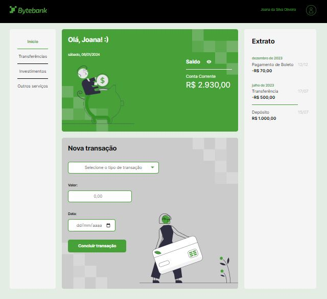

# Curso - TypeScript na prática: implemente um projeto completo com TypeScript e módulos

## Aulas

  ✔️ concluded &nbsp;&nbsp;&nbsp;|&nbsp;&nbsp;&nbsp;
  ⚫ not started &nbsp;&nbsp;&nbsp;|&nbsp;&nbsp;&nbsp;
  🔵 in progress &nbsp;&nbsp;&nbsp;|&nbsp;&nbsp;&nbsp;
  🔶 paused &nbsp;&nbsp;&nbsp;|&nbsp;&nbsp;&nbsp;
  🔴 abandoned 

| Aula | Titulo | Status |
| --- | --- | --- |
| 1 | JavaScript vs TypeScript | ✔️ |
| 2 | Definindo tipos | ✔️ |
| 3 | Aplicando o TypeScript | ✔️ |
| 4 | Modularizando o TypeScript | ✔️ |
| 5 | Finalizando o projeto do TypeScript | ✔️ |

---

## Aprendizados

### Aula 01 - JavaScript vs TypeScript
<ul>
  <li>Configuração do ambiente para criar um projeto simples com TypeScript.</li>
  <li>Instalação das ferramentas necessárias.</li>
  <li>Desenvolvimento de uma solução utilizando JavaScript e compreensão de suas limitações.</li>
  <li>Refatoração do código da solução para TypeScript e compreensão inicial de suas vantagens.</li>
</ul>

### Aula 02 - Definindo tipos
<ul>
  <li>Conhecemos o arquivo tsconfig.json e sua função em um projeto.</li>
  <li>Aprendemos as vantagens de trabalhar com tipos definidos.</li>
  <li>Exploramos a criação de tipos personalizados usando Type Alias e também a criação de Arrays tipados no TypeScript.</li>
  <li>Aprendemos o conceito e a aplicabilidade das Enums.</li>
</ul>

### Aula 03 - Aplicando o TypeScript
<ul>
  <li>Reorganizamos a estrutura de arquivos do projeto;</li>
  <li>Aplicamos os conceitos apresentados e explorados na aula 2;</li>
  <li>Realizamos a formatação de moedas e data nos formatos necessários;</li>
  <li>Analisamos os problemas que ainda persistem na aplicação e que podem ser resolvidos por meio dos módulos.</li>
</ul>

### Aula 04 - Modularizando o TypeScript
<ul>
  <li>Compreendemos as vantagens da utilização de módulos na criação de aplicações com TypeScript.</li>
  <li>Reestruturamos o projeto, redefinindo os papéis e responsabilidades de cada componente ou módulo da aplicação.</li>
  <li>Utilizamos os comandos import/export para importar recursos de outros módulos e disponibilizá-los para uso.</li>
</ul>

### Aula 05 - Finalizando o projeto do TypeScript
<ul>
  <li>Realizamos o armazenamento das informações da aplicação utilizando o localStorage.</li>
  <li>Agrupamos as transações por data e as exibimos por meio do componente de Extrato.</li>
  <li>Modificamos o objeto Date das Transações para exibir corretamente a data no front-end.</li>
  <li>Modificamos o objeto Date das Transações para exibir corretamente a data no front-end.</li>
</ul>

---

## 🎯 Projeto desenvolvido
Este é o screenshot do projeto **ByteBank** que foi desenvolvido durante o curso:

  

