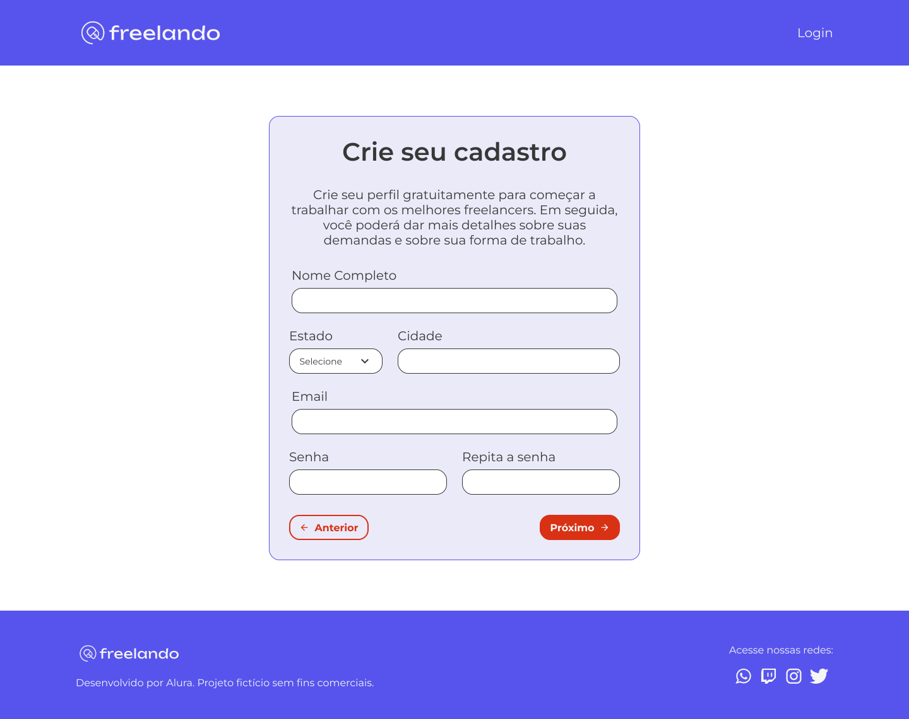

# Curso -  React: arquitetando soluções de roteamento e gestão de estado com React Router e Context API

## Aulas

  ✔️ concluded &nbsp;&nbsp;&nbsp;|&nbsp;&nbsp;&nbsp;
  ⚫ not started &nbsp;&nbsp;&nbsp;|&nbsp;&nbsp;&nbsp;
  🔵 in progress &nbsp;&nbsp;&nbsp;|&nbsp;&nbsp;&nbsp;
  🔶 paused &nbsp;&nbsp;&nbsp;|&nbsp;&nbsp;&nbsp;
  🔴 abandoned 

| Aula | Titulo | Status |
| --- | --- | --- |
| 1 | Um router para a todos governar  | ✔️ |
| 2 | Rotas aninhadas | ⚫ |
| 3 | Concluindo o fluxo | ⚫ |
| 4 | Desafios na gestão de estado | ⚫ |
| 5 | Controlando o fluxo dos dados | ⚫ |

---

## Aprendizados

### Aula 01 - Um router para a todos governar
<ul>
  <li>Escolher uma boa estratégia de roteamento;</li>
  <li>Entender o que é uma SPA;</li>
  <li>Diferenciar o Server Side Render do Client Side Render;</li>
  <li>Configurar um router base do React Router Dom.</li>
</ul>

### Aula 02 - Rotas aninhadas
<ul>
  <li></li>
</ul>

### Aula 03 - Concluindo o fluxo
<ul>
  <li></li>
</ul>

### Aula 04 - Desafios na gestão de estado
<ul>
  <li></li>
</ul>

### Aula 05 - Controlando o fluxo dos dados
<ul>
  <li></li>
</ul>

---

<!-- ## 🎯 Projeto desenvolvido
Este é o screenshot do **Freelando** que foi desenvolvido durante o curso:

  

 -->