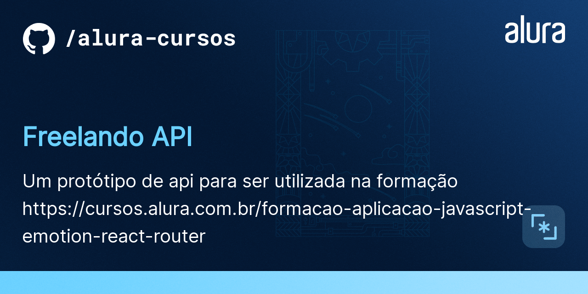
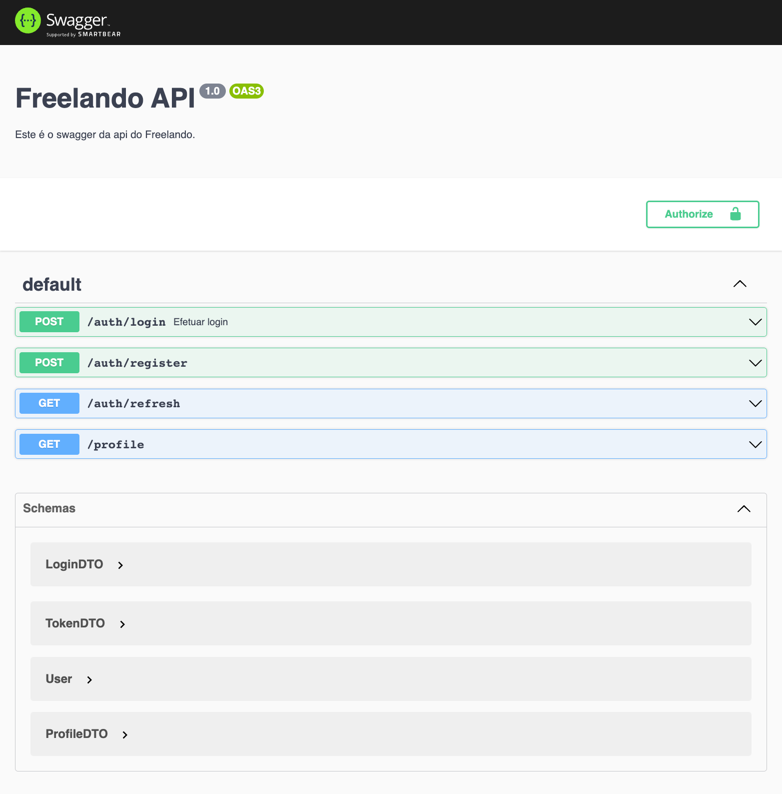

# Freelando

O Freelando é uma startup fictícia utilizada na formação [Criando uma aplicação acessível com JavaScript, Emotion e React Router](https://cursos.alura.com.br/formacao-aplicacao-javascript-emotion-react-router). 
É um MVP que tá só começando e ainda tem muitas funcionalidades novas para serem desenvolvidas.

# Api em Nest

Essa é uma API Rest mockada, um protótipo pra permitir o desenvolvimento do frontend.


## 🛠️ Instalação

```bash
$ npm install
```

## 🛠️ Execução

Abra um terminal e execute o seguinte comando:

```bash
$ npm run start
```

Agora sim, deixe o terminal em execução está tudo pronto para o início do curso!


## 🛠️ Documentação

Com a aplicação em execução, abra o seu navegador e acesse http://localhost:8080/api para ter acesso ao Swagger, a fonte de verdade sobre a nossa API e como ela funciona:




## Autenticar próximas requests?

Basta adicionar ao header da request:

```
Authorization: Bearer <ACCESS_TOKEN>
```

## 📚 Mais informações do curso

O Freelando é o projeto utilizado durante toda a formação, e essa API será utilizada em vários cursos diferentes :)