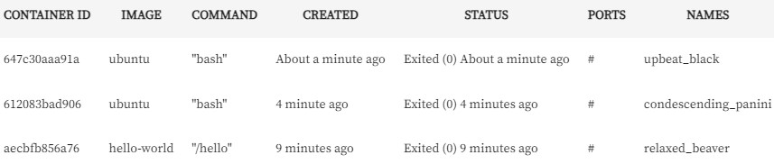
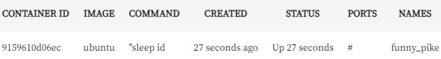
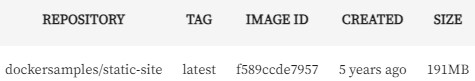
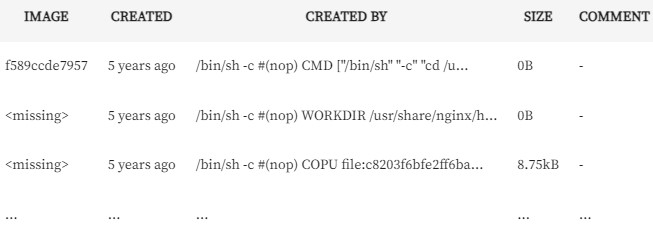
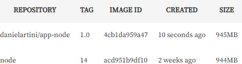

# Anotações Curso - Docker: criando e gerenciando containers

---

### Máquinas virtuais
Existe uma solução já bem difundida, que não é recente e ajuda a resolver esses problemas: as máquinas virtuais, onde teríamos o hardware bem definido; o sistema operacional, seja ele Windows, Linux, Mac ou outro; e uma camada de hypervisor, que fará um meio de campo para virtualizar um novo sistema operacional.

Esse sistema pode ser um Windows, um Linux, um Mac, rodando dentro de outro sistema, mas graças a essa camada de hypervisor, teríamos uma camada de isolamento desse sistema operacional original. Assim, conseguiríamos instalar as nossas dependências e aplicações de maneira isolada, porque cada uma delas tem o seu respectivo sistema operacional.

Essa solução resolve esses problemas iniciais, mas a pergunta que fica nesse momento é a seguinte: é realmente necessário fazer isso?

Queremos executar as nossas aplicações, como vimos, de maneira isolada, ter um controle de recursos, e ter um controle de versionamento bem definido. Então, essa camada de hypervisor é realmente necessária? Nessas situações, precisamos sempre virtualizar um sistema operacional? Pode ser que sim, pode ser que não, mas no caso que vamos abordar durante este curso, é a utilização de **containers**.

No caso do uso de containers, não temos a camada de sistema operacional virtualizado, nem a de hypervisor, mas sim a camada diretamente do container rodando o sistema operacional, e mesmo assim, de forma isolada. Cada aplicação está isolada entre si e também isolada do sistema operacional original.

---

### Como os containers funcionam?:
O container funciona da seguinte maneira: dentro de um sistema operacional, temos vários containers, isto é, diversas aplicações sendo executadas. No entanto, eles funcionarão diretamente como processos dentro do nosso sistema.

Enquanto uma máquina virtual terá toda aquela etapa de virtualização dos sistemas operacionais dentro do sistema original, os containers funcionarão diretamente como processos dentro do sistema.

Portanto, no que diz respeito ao consumo, podemos visualizar que ele será um pouco menor. O consumo de recursos, a carga para que ele possa ser executado, é um pouco menor, porque eles serão processos, e não uma virtualização completa.

--- 

### O que são namespaces?
Teremos os principais namespaces:
 - PID -> garante o isolamento a nível de processo dentro de cada um dos containers. Portanto, um processo dentro de um container, que, consequentemente, é um processo dentro do sistema operacional, estará isolado de todos os outros do nosso host, isto é, da nossa máquina original.
 - NET -> o namespace de rede, que garantirá o isolamento entre uma interface de rede de cada um dos containers e também do nosso sistema operacional original.
 - IPC ->  intercomunicação entre cada um dos processos da nossa máquina. 
 - MNT -> é a parte de file system (sistema de arquivos), montagem, volumes e afins, também estará devidamente isolado
 - UTS ->  faz um compartilhamento e um isolamento ao mesmo tempo do host, isto é, do kernel, da máquina que executa o container.

 ---

 ### Cgroups:
 Por fim, na parte de gerenciamento de recursos, suponha que queiramos definir, conforme levantado em um problema anteriormente, o consumo máximo de memória, de CPU e afins para cada um dos containers.

Existe outro conceito chamado Cgroups, que garantirá que podemos definir, tanto de maneira automática, quanto de maneira manual, como os consumos serão feitos para cada um desses processos, isto é, para cada um desses containers dentro do sistema operacional.

De volta às perguntas originais, graças aos namespaces e aos Cgroups, conseguimos garantir o isolamento, garantir que o nosso container funciona sem instalar um sistema operacional dentro dele, e também conseguir ter um controle de gerenciamento de recursos como memória e CPU.

Quanto à questão de por que eles são mais leves, entendemos que eles funcionarão como processos diretamente do sistema operacional, mas ao longo deste curso, entenderemos ainda mais por que eles conseguem ser tão mais práticos em relação a uma máquina virtual em termos de consumo de recursos e de tamanho de armazenamento também no nosso sistema operacional.

---

### Instalando o Docker no Windows:
1.  acessar a página da documentação oficial [Install Docker Desktop on Windows](https://docs.docker.com/desktop/install/windows-install/)
2. clicar no botão "Docker Desktop for Windows".
3. Após baixar o arquivo, basta abrir o instalador e seguir o fluxo de instalação normalmente.
4. Depois de um tempo, o instalador abrirá uma tela com algumas opções. Neste momento, ele tem duas opções: 
  - instalar os componentes necessários para o Docker rodar com o Windows em WSL 2; 
  - e adicionar um atalho na área de trabalho. Vamos marcar essas duas opções e clicar em "OK" para instalar.

### Informações importantes:
Enquanto o Docker é instalado, há alguns pontos importantes a destacar. O primeiro é que, caso você seja uma pessoa usuária de Docker ou esteja começando agora, e esteja pensando em utilizar o Windows para isso, recomendamos fortemente que não utilize o Docker no Windows, e sim no Linux, que é um ambiente muito mais estável e preparado para gerenciar e utilizar essa plataforma de conteinerização.

Outro ponto é que o Docker está fazendo uma atualização nos termos de uso dele. O Docker Desktop, que utilizamos no caso do Windows, passará a ser pago a partir de 31 de janeiro de 2022, caso sua empresa tenha mais de 250 pessoas trabalhadoras ou uma receita anual de mais de 10 milhões de dólares.

Esse é um ponto que você deve ter atenção, a depender da empresa em que trabalha. O uso para estudo, até o momento da gravação deste curso, continua liberado.

Outro ponto de atenção deve ser o WSL 2 backend, que vimos no momento da instalação do Docker. O WSL 2 é o Windows Subsystem for Linux (Subsistema Windows para Linux), que significa que teremos um subsistema Linux rodando dentro do Windows. Ele virtualiza, de modo simplificado, o sistema operacional Linux, para que possamos utilizar o Docker nesse sistema operacional.

Caso você já tenha o Windows instalado, tanto o Windows 11 quanto o Windows 10, nas respectivas versões indicadas na documentação, basta habilitar o WSL 2 no seu sistema operacional Windows, em conjunto com a documentação da Microsoft. Em conjunto com o PowerShell, você consegue instalar o WSL seguindo toda a documentação. Caso queira visualizar a documentação em português, basta alterar o idioma.

---

### Executando o Docker:
Uma vez concluída a instalação, para verificar se o Docker está funcionando corretamente, precisamos executá-lo. Podemos fazer isso através do menu "Iniciar" ou clicando no ícone de atalho do Docker Desktop na área de trabalho. Ao clicar duas vezes, ele começará a carregar o Docker para que a máquina execute tudo o que é necessário para que ele funcione no ambiente Windows.

Para testar se o Docker realmente funciona, utilizaremos o PowerShell do próprio Windows. Para isso, podemos executar no terminal Windows PowerShell o comando docker run seguido de hello-world, um container clássico para verificar se o Docker está em funcionamento.

```
docker run hello-world
```

Na primeira execução, foi retornado um erro dizendo que não conseguiu encontrar uma imagem hello-world na versão latest localmente (locally). Porém, após alguns instantes, o comando executa e mostra a mensagem "Hello from Docker"" ("Olá do Docker""), indicando que a instalação funcionou.

---

### Compreendendo containers:
O Docker é uma plataforma que implementa virtualização de software e utiliza a tecnologia de contêineres para facilitar a implantação e execução de aplicações. Podemos entender contêiner como uma unidade leve e portátil que irá conter todo o necessário para executar um pedaço de software, incluindo o código, runtime, bibliotecas e dependências. Neste modelo de virtualização temos diversos benefícios,com destaque para: isolamento de contextos e o versionamento de aplicações.

-> **Isolamento de Contextos** - Como cada contêiner possui seu próprio sistema de arquivos, processo, espaço de rede e recursos, garantindo que a aplicação dentro do contêiner não interfira em outras aplicações ou no sistema hospedeiro, isso proporciorna um alto grau de independência e isolamento.

-> **Versionamento de Aplicações** - No docker as aplicações são encapsuladas em imagens, que são versões imutáveis e autossuficientes. Uma imagem docker é composta por camadas, permitindo versionamento eficiente e a reutilização de partes comuns entre diferentes aplicações. Utilizando um arquivo conhecido como Dockerfile, o versionamento é facilitado , um arquivo de configuração que descreve os passos para criar uma imagem. As alterações no Dockerfile resultam em novas versões da imagem, garantindo consistência na implantação.

O Docker proporciona uma abordagem eficiente para o desenvolvimento, empacotamento e execução de aplicações, trazendo benefícios como isolamento de contextos, consistência entre ambientes e versionamento controlado. Essas características tornam o Docker uma ferramenta poderosa para equipes de desenvolvimento e operações que buscam eficiência e confiabilidade em todo o ciclo de vida de uma aplicação.

---

## Conhecendo o Docker Hub
Retornando ao terminal, repetiremos o comando docker run hello-world do início para observar os resultados.

```docker run hello-world```

Neste ponto, é comunicado que a imagem não está presente localmente, desencadeando o download. Ao término, o processo é concluído com a validação de sha256, cuja interpretação será abordada.

```
Unable to find image 'hello world:latest' locally

Latest: Pulling from library/hello-world

2db29710123e: Pull complete Digest:sha256:2498fce14358aa50ead0cc6c19990fc6ff866ce72aeb5546e1d59caac3d0d60f

Status: Downloaded newer image for hello-world: latest
```

A saída do container associado ao hello world é exibida (desde Hello from Docker até o final do retorno). Limparemos o terminal para prosseguir com um novo docker run. Em vez de inserir simplesmente hello world, questionaremos a origem ao fornecer uma sequência aleatória de caracteres, pressionando "Enter".

```
docker run cmsdokcmsdocmsdcoiscmdsoicmdiocsmdicosdmciosdmcidsocmsdiocms
```

Como retorno, obtemos:

```
Unable to find image 'cmsdokcmsdocmsdcoiscmdsoicmdiocsmdicosdmciosdmcidsocmsdiocms: latest' locally

docker: Error response from daemon: pull access denied for cmsdokcmsdocmsdcoiscmdso icmdiocsmdicosdmciosdmcidsocmsdiocms, repository does not exist or may require 'docker login': denied: requested access to the resource is denied.

See 'docker run --help'.
```

Na etapa inicial, a situação permanece inalterada: é mencionado que a busca pela imagem local não teve êxito. Em seguida, surge uma mensagem de erro indicando uma negação de acesso ou inexistência do repositório que contém a imagem. Contudo, o significado de "imagem" ainda não foi completamente esclarecido; essa resposta será gradualmente desenvolvida, resultando em uma explicação final.

É importante compreender que, para o funcionamento do nosso docker run, é necessário localizar essa entidade denominada imagem, a fim de que o container seja efetivo. Quando inserimos um nome sem sentido, como no caso anterior, o Docker não o localiza. No entanto, ao utilizar hello world, a localização é bem-sucedida.

Como o Docker identifica os locais para procurar e encontrar esses nomes, resolvendo e executando nosso container?

Um vasto repositório, conhecido como [Docker Hub](https://hub.docker.com/) , abriga uma variedade dessas imagens, correspondendo aos parâmetros que estamos especificando. Voltamos ao terminal. Se executarmos docker run --help, notamos as informações apresentadas.
```docker run --help```

Além das diversas flags retornadas, o comando docker run segue a seguinte estrutura:
```Usage: docker run [OPTIONS] IMAGE [COMMAND] [ARG...]```

O [docker run](https://hub.docker.com/), algumas opções (a serem compreendidas em breve), e o nome da imagem que pretendemos executar. Portanto, hello world é o nome de uma imagem. Aquele nome sem sentido que passamos também foi uma tentativa de nome de uma imagem. Isso significa que, se formos ao Docker Hub e pesquisarmos na parte superior, por exemplo, por hello world, ele vai encontrar essa imagem.

A imagem oficial significa que ela foi criada e é mantida por um grupo confiável de pessoas desenvolvedoras e tem reconhecimento da comunidade. Ela recebe esse selo de oficial. Na parte inferior da busca, ele mostra as instruções, o que é essa imagem efetivamente, conta uma breve história sobre ela e pronto.

Se tentarmos pesquisar no Docker Hub por aquele nome sem sentido que criamos, nada será encontrado. É por isso que, ao executarmos o docker run com aquele nome sem sentido, não houve sucesso. No entanto, hello world já está disponível.

Agora, que outras ações podemos realizar para começar a levantar algumas perguntas? Quais imagens adicionais são interessantes para explorar na parte do docker run e compreender seu funcionamento? Há uma variedade de imagens que replicam, por exemplo, o conteúdo de um sistema operacional.

Portanto, embora um container não seja obrigado a ter um sistema operacional instalado, ele tem a capacidade de incluir um sistema operacional, como o Ubuntu, por exemplo. Se pesquisarmos no Docker Hub por Ubuntu no campo de busca na parte superior, encontramos uma imagem oficial, criada e mantida por um grupo confiável de pessoas. Essa imagem, quando executada, gera um container baseado no Ubuntu.

Voltaremos ao terminal, teclamos "Ctrl + R", utilizado apenas para encerrar. A questão em foco é: ao executarmos o comando docker run ubuntu, ele realizará exatamente isso.
```docker run ubuntu```

Ele acessa o Docker Hub, adquire a imagem e inicia o container. Ou, se optarmos por uma abordagem passo a passo, retornando ao Docker Hub, primeiramente podemos baixar a imagem para posterior execução. Portanto, voltando ao terminal, em vez de docker run ubuntu, podemos utilizar docker pull ubuntu.

```docker pull ubuntu```

Obtemos como retorno:
```
Using default tag: latest

latest: Pulling from library/ubuntu 1

7b1a6ab2e44d: Pull complete

Digest: sha256:626ffe58f6e7566e00254b638eb7e0f3b11d4da9675088f4781a50ae288f3322

Status: Downloaded newer image for ubuntu: latest

docker.io/library/ubuntu: latest
```

O processo envolve o download, com uma saída inicial semelhante, não indicando localização local, pois estamos solicitando o download. Ele realiza a operação, extrai e, por fim, verifica. No entanto, não executa, pois apenas solicitamos o download da imagem.

Agora, se solicitarmos a execução com o comando, ele não fará o download, pois já possuímos a imagem localmente. Assim, podemos simplesmente inserir docker run ubuntu para que o container seja executado.

E qual é o desdobramento aqui? Nada. Por quê? No momento do comando docker run ubuntu, o que esperávamos? A criação de um container com Ubuntu e a execução de alguma operação. "Bem-vindo ao Ubuntu," talvez.


O comando docker run é responsável por executar um container em nosso host. Através deste comando, o docker irá executar o container da maneira esperada.


---

## Fluxo da criação de containers:
Entendendo o erro
Primeiramente, por que o container não funcionou? Retornamos ao nosso terminal mais uma vez. Tentaremos novamente executar o docker run ubuntu.
```docker run ubuntu```

Sem novidades. Contudo, compreenderemos e exploraremos outros comandos do Docker que nos auxiliarão a verificar se o container de fato foi executado e por que não exibe nada.

Um comando extremamente útil que utilizamos com frequência é o docker ps, que mostra quais containers estão em execução no momento. Limpamos a tela e executaremos docker ps.
```docker ps```

Obtemos como retorno:
```
CONTAINER ID IMAGE COMMAND CREATED STATUS PORTS NAMES
```

Exibiu apenas o cabeçalho. Isso indica que a tabela de containers em execução está vazia. Não há nenhum container de fato em execução. Outra maneira, por mera curiosidade, de utilizar o docker ps, um tanto mais semântica, é através do comando docker container ls.

```docker container ls```

É essencialmente o mesmo comando, um pouco mais longo, porém ao mesmo tempo mais semântico. Também apresentará o mesmo resultado que o comando anterior.
```
CONTAINER ID IMAGE COMMAND CREATED STATUS PORTS NAMES
```

Como percebemos agora, temos ciência de que nosso container não está em execução. Como visualizamos todos os containers, inclusive os que já não estão mais em execução, para determinar se nosso comando docker run teve algum efeito efetivo?

Esse comando pode ser simplesmente o docker ps -a ou docker container ls -a, sendo essencialmente o mesmo.

```docker container ls -a```

Executamos e observamos que possui nosso hello-world, executado há nove minutos, o Ubuntu, e outro Ubuntu. Este último é o que configuramos anteriormente, enquanto o primeiro é o último que executamos agora.


Entendemos cada uma dessas colunas. A primeira é o container id, um identificador. A imagem usada como base para criar esse container, então docker run ubuntu, docker run ubuntu, docker run hello-world. O comando executado ao criar esse container, então aqui foi um bash, aqui foi um /hello, também foi um bash.

Criados há um minuto, quatro minutos e nove minutos, respectivamente. Todos eles têm status excited, razão pela qual não foram exibidos no docker ps ou docker container ls, somente quando usamos a flag -a.

Vamos compreender em breve a questão das portas, e name é simplesmente um nome atribuído automaticamente pelo Docker ao container quando não especificamos um nome. Não estamos preocupados com isso por enquanto; é apenas um detalhe. O Docker cria um nome aleatório para os containers.

Agora, voltando para responder à pergunta: por que o container não está em execução? A resposta está nesta linha de comando. Ao executar o container a partir da imagem, como no caso da imagem do Ubuntu, é configurado para iniciar e executar o comando bash. No caso da imagem do hello world, ele executa /hello.

O que ocorre quando executamos novamente docker run ubuntu? O Docker inicia o container, executa o comando bash e conclui. Ao executar o comando bash, o Docker atinge seu objetivo. Neste momento, o container foi executado, subiu, realizou o bash, desempenhou sua função de execução, e a partir desse ponto não havia mais nenhum processo sustentando a existência do container. Por isso, ele foi encerrado.

Para que um container permaneça em execução, é necessário ter pelo menos um processo em seu interior. Se não houver nenhum processo em execução, o container não permanecerá ativo. Como solicitamos apenas a execução do bash, o container iniciou, cumpriu sua função e encerrou.

Essa é a primeira consideração. Ao executarmos o comando run, ele executou essa instrução e encerrou imediatamente, pois não mantivemos nenhum processo em execução naquele momento.

Ao mesmo tempo, se chegarmos agora, limpamos o terminal e executamos o comando docker run ubuntu mais uma vez. O que faremos? Ao executarmos o comando docker run --help, observamos que ao especificar a imagem, podemos enviar um comando para que esse container execute.

```Usage: docker run [OPTIONS] IMAGE [COMMAND] [ARG...]```

Podemos sair do comando e limpar o terminal.

O que faremos? Sabemos que, dentro do Ubuntu como um todo, temos a linha de comando que podemos usar. Então, desejamos que esse container, por exemplo, execute o comando sleep e passaremos 1d.
```docker run ubuntu sleep 1d```

Desejamos que o comando que o container execute, quando o Ubuntu subir, seja um sleep de um dia. Tecnicamente, quando o container subir, terá um processo de sleep, mantendo-o inativo por um dia. Isso funcionará? Veremos agora. Teclamos "Enter". Ele aparentemente travou nosso terminal.

Então, faremos o seguinte: como travou o terminal, abriremos um novo e faremos o seguinte. Agora, se executarmos o docker ps, veremos o que acontecerá.
```docker ps```


O docker ps mostra um container id com a imagem Ubuntu e um comando sleep de um dia. Como esse comando levará um dia para ser concluído, nosso container terá uma vida útil de um dia e está em execução, com um status up há 27 segundos. Quanto às portas, por enquanto, ignoraremos a questão, o nome é funny_pike.

Agora compreendemos como manter um container em execução e por que ele para quando não especificamos um comando a ser executado. Antes, não havia nada impedindo sua execução; agora temos o sleep de um dia que fornecemos para o container executar.

## Como funciona o comando docker run?
A segunda pergunta que precisamos responder é o que aconteceu nos bastidores para que nosso container pudesse ser executado daquela primeira vez?

Na ocasião em que nosso host, o Ubuntu neste caso, executou o comando docker run ubuntu, docker pull ubuntu, ele simplesmente foi até o Docker Hub e solicitou a imagem chamada Ubuntu. O Docker Hub respondeu afirmando ter essa imagem e a disponibilizou para nós.

Realizamos o download dessa imagem, e em seguida, nosso host fez, na etapa em que observamos o digest e sha256, uma validação para assegurar a autenticidade da imagem, verificando se é realmente a imagem que procurávamos.

Ao realizar o docker run, se não a tivermos localmente, buscamos no Docker Hub, validamos através de um hash e executamos nosso container. Este geralmente possui, como visto no caso do Ubuntu, um comando padrão a ser executado, que, ao compararmos com o menu rodando o comando docker ps -a no terminal, seria o bash.

Caso não tenhamos cuidado, acabaremos criando containers zumbis que iniciarão e logo encerrarão, pois não teremos nenhum processo impedindo sua finalização. Contudo, agora sabemos que, mantendo pelo menos um processo, nosso container permanecerá em execução.

## Etapas do run
Quando queremos executar um container e usamos o comando docker run, ocorre uma série de etapas ordenadas até que a execução seja feita efetivamente.

Este é o fluxo adotado pelo docker para execução de um container:
Procura a imagem localmente -> Baixa a imagem caso não encontre localmente -> Valida o hash da imagem -> Executa o container.

## Run vs Exec
Recentemente vimos sobre o comando docker run e docker exec. Sabemos que ambos os comandos envolvem o fluxo de inicialização e execução de comandos em containers, porém em contextos diferentes.

O docker run cria um novo container e o executa. O docker exec permite executar um comando em um container que já está em execução.

---


## O que são imagens?
Até agora, temos aceitado que as imagens são uma receita para criar um container, mas efetivamente como elas funcionam?

Uma imagem nada mais é que um conjunto de camadas, que ao serem unidas formam imagens. E essas camadas são independentes, cada uma tem o seu respectivo ID (identificador).

Vamos voltar para o terminal no caso do dockersamples para visualizar esse exemplo.

Após executar um docker pull do dockersamples e um docker run na nossa imagem, podemos visualizar as imagens que temos baixadas no nosso sistema, através do comando docker images ou docker image ls.

```docker images```


Temos baixada a nossa imagem, que é o dockersamples/static-site, com essa tag latest, com seu respectivo ID. E ela foi criada há cinco anos pelo grupo do dockersamples e o tamanho dela é 191 megabytes.

Podemos ir um pouco mais além, podemos dar o comando docker inspect em uma imagem passando o identificador do que queremos inspecionar.
```docker inspect f589ccde7957```

Dessa maneira, teremos diversas informações.
Retorno parcialmente transcrito:

```
[
    {
        "Id": "sha256:f589ccde7957fa3ddf76a2eeee4d2f5d687b32176f559b703b6b8cacf6d36
        bc4",
        "RepoTags": [
            "dockersamples/static-site:latest"
        ],
        "RepoDigests": [
            "dockersamples/static-site@sha256:daa686c61d7d239b7977e72157997489db49f316b9b9af3909d9f10fd28b2dec"
        ],
        "Parent": "",
        "Comment": "",
        "Created": "2016-03-18T10:59:54.367126Z",
    }
]
```

Temos um conjunto muito grande de informação que podemos ter detalhadamente sobre determinado recurso dentro do nosso Docker.

Por exemplo, o ID, a tag do repositório, o digest que foi utilizado para validação da imagem, se tem alguma imagem que é um parent, uma imagem pai ou mãe, a data de criação, o container e sua configuração. Inclusive, no final, temos mais informações sobre a parte de layers, ou seja, das camadas.

Existe um comando específico para verificar quais são as camadas de uma imagem. Basta usar o comando docker history, passando o ID da imagem.

```docker history f589ccde7957```



Repare que temos a nossa imagem f589ccde7957 na primeira linha. Ela tem 13 camadas, as quais quando são aglutinadas, ou seja, quando são empilhadas umas nas outras formam essa imagem final do dockersamples/static-site. E caso alguma outra imagem venha a depender dessas camadas, conseguimos reutilizá-las.

Ele mostra detalhadamente qual é o tamanho de cada uma dessas camadas, a data de criação e a ordem de cada uma delas, como CMD, WORKDIR, COPY. Assim, conseguimos verificar todas essas informações e entender o que está acontecendo.

Em resumo, uma imagem é um conjunto de camadas empilhadas para formar determinada regra de execução de um container.

---

## Como imagens viram containers?
Quando fizemos o comando docker run pela primeira vez, ou simplesmente um docker pull, não para executar o container, mas só baixar a imagem, o que pode acontecer? Vamos fazer o download das nossas imagens, das nossas camadas.

Mas é possível que, por exemplo, já tenhamos algumas das camadas que queremos no nosso host. Por isso, no momento em que fazemos um pull ou um run, que vai fazer um pull consequentemente, faremos os downloads simplesmente das camadas que necessitamos.

O Docker é inteligente o suficiente para reutilizar essas camadas para compor novas imagens, conseguindo assim uma performance muito boa, já que não precisaremos ter informação duplicada ou triplicada, porque conseguimos reutilizar as camadas em outras imagens.

O que mais podemos explorar na parte de criação de imagens? No fim das contas, quando temos a nossa imagem, ela é read-only (somente leitura), isso significa que não conseguimos modificar as camadas dessa imagem, depois que ela foi criada.

Voltando ao exemplo no terminal, no momento em que temos a imagem do dockersamples/static-site, ela é imutável - assim como a imagem que temos do Ubuntu.

Mais uma vez, se fazemos docker run -it ubuntu bash para executar o bash em modo iterativo, vamos baixar a camada necessária para ter a nossa imagem de execução para que consigamos executar nosso container do Ubuntu.
```docker run -it ubuntu bash```

Como o instrutor já apagado a imagem, ela será baixada, extraída e o terminal será aberto.

Contudo, havíamos criado na home um arquivo qualquer de exemplo com o comando touch um-arquivo-qualquer.txt. Isso significa que estaríamos escrevendo dentro do container. Mas como estamos conseguindo fazer isso se a imagem que gera o nosso container é apenas para leitura (read only)?

Se ela é bloqueada para escrita, como é que o container consegue escrever informação dentro dela? Porque um container nada mais é do que uma imagem com uma camada adicional de read-write (leitura e escrita).

Quando criamos um container, criamos uma camada temporária em cima da imagem, onde conseguimos escrever informações. E, no momento em que esse container é deletado, essa camada extra também é deletada.

Por isso que quando fizemos aquele experimento anteriormente, a nossa informação dentro do container era perdida quando nosso container era apagado. Porque essa camada é temporária, bem fina e leve para que o container tenha um ambiente de execução muito leve e fácil de ser executado.

---

## Por que os containers são tão leves?
Agora voltamos àquela primeira pergunta, onde questionávamos por que os containers são tão leves.

Além de serem simplesmente processos dentro do nosso sistema, podemos dizer que, quando um container entra em execução, estamos sempre reaproveitando a mesma imagem.

Como a imagem é apenas de leitura, podemos ter vários containers baseados na mesma imagem. A diferença é que cada um desses containers terá apenas uma camada diferente de read-write, e como essa camada é extremamente leve, a fim de manter essa performance, temos uma reutilização da imagem para múltiplos containers.

No fim das contas, o que acontece é que quando definimos um container ou outro container baseado na mesma imagem, o tamanho desse container será apenas o tamanho da camada de escrita que estamos gerando para ele, porque a imagem será reutilizada para cada um deles.

Em breve, faremos um experimento prático, conforme formos avançando na criação e no fluxo das nossas imagens.

O container é leve e otimizado, porque consegue reaproveitar as camadas das imagens prévias que já temos. E, quando criamos novos containers, ele simplesmente reutiliza as mesmas imagens e, consequentemente, as camadas.

Além disso, utiliza a camada de read-write para utilizar de maneira mais performática o que ele já tem no ecossistema do Docker.

---

##  Criando a primeira imagem
 Primeiro, definimos um arquivo Dockerfile e a partir dele criamos nossa imagem. Uma vez em posse da imagem, basta executar o comando run para gerar um container a partir da imagem.

**Definindo arquivo Dockerfile**
[aplicação node](https://github.com/danielartine/alura-docker/blob/aula-3/app-exemplo.zip?raw=true)
[imagem do Node no Docker Hub](https://hub.docker.com/_/node)

Para esse projeto, vamos usar uma aplicação Node. Ressaltamos que não vamos entrar em nenhum detalhe específico de Node ou qualquer linguagem de programação, apenas usamos como exemplo para ter uma aplicação efetiva para empacotar, transformar em uma imagem e depois em um container.

O que queremos é que, ao executar nosso container e acessá-lo via nosso host, por exemplo, mapeando as portas, tenhamos a visualização, da aplicação em execução. Nesse caso, será uma tela azul com a frase "Eu amo Docker!".

Mas não queremos simplesmente clicar duas vezes no arquivo index.html para abri-lo, queremos um servidor que nos disponibilize essa aplicação.

Portanto, de alguma maneira, precisamos colocar todo o conteúdo da aplicação dentro de uma imagem, instalar o Node, que será responsável por executar o servidor e, finalmente, quando nosso container executar, queremos que ele execute algum comando que mantenha esse servidor em execução.

Neste caso, vamos utilizar o Visual Studio Code para fazer a edição de texto, mas você pode usar o IDE de sua preferência.

De ínicio, vamos criar um novo arquivo clicando em "File > New File" (ou "Ctrl + N") e apertar "Ctrl+S" para salvá-lo dentro da nossa pasta de "exemplo-node", que também estará disponível para download.

Dentro desta pasta, vamos criar um arquivo chamado Dockerfile, que é basicamente o arquivo que vamos criar. Repare que o VS Code consegue reconhecer que é um arquivo Dockerfile.

Dentro deste arquivo, vamos definir como será a criação da nossa imagem. O que queremos fazer? Nós queremos que dentro do nosso projeto como um todo nós tenhamos o Node para que consigamos rodar um servidor.

Então, se queremos usar o Node como base para nossa aplicação, podemos pegar emprestado o que já desenvolveram. Assim, poderíamos fazer o pull dessa imagem já existente para poder usar em nosso projeto, e a partir daí, fazer modificações para customizar o projeto da nossa maneira.

No fim das contas, precisamos do Node. Mas como colocamos o Node dentro da nossa imagem por padrão? A princípio, poderíamos colocar um Ubuntu e dentro desse Ubuntu, instalar o Node e fazer toda a configuração necessária.

Porém, não precisamos ter necessariamente um sistema operacional dentro do nosso container. Podemos simplesmente usar uma imagem que já disponibilize o Node para nós, como a própria imagem do Node no Docker Hub, que é uma imagem oficial.

A descrição contém todas as versões que podemos definir, desde a versão 17 até a 12. Então, o que podemos fazer neste cenário? Podemos simplesmente dizer que queremos pegar uma dessas versões do Node para executar nosso projeto e usar essa imagem como base para a nossa. A partir da imagem que vamos definir, começamos a usar a nossa.

Como pegamos uma imagem emprestada? Por exemplo, se queremos usar o Node na versão 14, devemos definir isso dentro do arquivo Dockerfile.

Para definir que queremos pegar a partir do Node, digitamos FROM node. Mas como explicitar a versão? Utilizando dois pontos e a versão que queremos:
```FROM node:14```

Como sabemos que é preciso escrever 14? Porque na documentação da imagem do Node, ele mostra quais são as tags suportadas, inclusive a 14.

A partir do Node na versão 14, o que queremos fazer? Queremos colocar todo o nosso projeto, que são esses arquivos do diretório exemplo-node, exceto o próprio Dockerfile, dentro dessa imagem.

Portanto, queremos copiar o conteúdo do nosso host para nossa imagem. Mas como fazemos isso? Podemos simplesmente colocar o COPY. Queremos copiar o quê? Todo o conteúdo do nosso diretório atual. Em que diretório está o nosso Dockerfile? No "exemplo-node".

Então, todo o conteúdo do nosso diretório atual, queremos copiar para algum diretório dentro do nosso container, por exemplo, para uma pasta chamada /app-node.
```COPY . /app-node```

A partir deste momento, estamos copiando esse conteúdo do diretório do nosso host para o diretório dentro da nossa imagem chamado /app-node.

E o que precisamos fazer? Queremos executar o comando npm install, mas esse comando deve ser executado dentro do nosso diretório /app-node, para que possamos instalar as dependências da nossa aplicação.
```RUN npm install ```

Caso você não conheça Node, esse comando basicamente é responsável apenas por instalar as dependências que nosso projeto precisa em um projeto Node. Basicamente, estamos instalando as dependências e o Node está resolvendo isso automaticamente.

Por fim, queremos que o ponto de entrada (ENTRYPOINT) do nosso container ao executar essa imagem e começar a ter seu container devidamente em execução, seja iniciar a aplicação. Para isso, usamos npm start.
```ENTRYPOINT npm start```

Esse comando também tem que ser executado dentro desse diretório /app-node. Mas teríamos que colocar /app-node em todos os lugares. Será que poderíamos resolver isso de uma maneira mais simples?

Por exemplo, queremos que todos esses comandos sejam executados no diretório que estamos atualmente por padrão. E como definimos qual é o diretório que a imagem vai tratar como padrão? Qual será o meu diretório de trabalho, por assim dizer?

Para isso, existe a instrução WORKDIR, e com ela podemos definir o nosso diretório padrão /app-node.

Com isso, podemos modificar o COPY inclusive. Podemos fazer um COPY de ponto, ou seja, esse ponto é o diretório atual dentro do nosso host, para ponto também, que será o nosso diretório atual dentro da nossa imagem.

Qual será o nosso diretório atual? Nosso /app-node, que foi definido através do nosso WORKDIR.

```
FROM node:14
WORKDIR /app-node
COPY . .
RUN npm install
ENTRYPOINT npm start
```

O que estamos fazendo? Estamos definindo que vamos utilizar a imagem do node na versão 14 como base para a nossa imagem. Também vamos definir o nosso diretório de trabalho padrão como o /app-node.

Depois, vamos copiar do diretório atual, onde está o Dockerfile do nosso host, que é esta pasta "exemplo-node", para a pasta atual dentro da nossa imagem, que é o /app-node, que foi definida dentro do nosso WORKDIR.

Finalmente, vamos executar esse comando npm install, enquanto a imagem estiver sendo criada. Este comando npm install será executado na etapa de criação da imagem. E quando o container for executado a partir dessa imagem, o comando executado será o npm start.

**Criando a imagem**
Após salvar o arquivo, vamos ao terminal e acessar o diretório exemplo-node que está na área de trabalho.
```cd Desktop/exemplo-node/```

Como podemos gerar uma imagem a partir do arquivo Dockerfile? Através do comando docker build, passamos o -t, para criar um nome, ou seja, etiquetar a nossa imagem. Nesse caso, vamos colocar danielartini/app-node, por exemplo, na versão 1. Com os dois pontos (:), podemos explicitar qual é a versão que estamos criando.

Em qual contexto tudo isso terá que ser executado? No contexto do diretório atual, ou seja, ponto (.) que é a referência ao diretório atual.

```docker build -t danielartine/app-node:1 .```

Ao executar esse comando, o Docker vai ao Docker Hub buscar a imagem do node, na versão 14, para baixá-la. Em outras palavras, ele pega todo esse conteúdo para a nossa máquina e vai construir uma nova imagem, utilizando essa como base.

No momento em que todos os 5 passos terminarem, vamos executar o comando docker history para verificar o que ele vai fazer e entender como essa imagem vai se comportar dentro do nosso sistema.

É importante mencionar que todas as instruções podem ser deduzidas a partir da própria documentação do Docker. É uma documentação muito completa, na qual podemos e devemos nos basear para seguir nossos projetos de criação de imagens.

Nesta documentação, temos as principais instruções para a criação de uma imagem - desde como as sintaxes funcionam até como escapar caracteres.

São listadas algumas instruções que já usamos, como FROM, ADD, COPY e WORKDIR, e também outras que ainda vamos conhecer, como ENV, EXPOSE, VOLUME e LABEL para etiquetar as imagens.

Dentro da documentação, teremos diversos exemplos para entender como funcionam essas instruções e como aplicar aos nossos projetos. Mas ainda teremos outros exemplos de criação de imagens. Esse é só o primeiro para entender realmente como vai funcionar.

Voltando para o terminal, ele está terminando de extrair nesse momento as últimas camadas dos downloads que ele fez da imagem do Node.

```Status: Downloaded newer image for node:14```

Feito isso, passamos para a etapa de WORKDIR, depois de cópia de arquivos e execução do npm install. E por fim, ele definiu o npm start no ENTRYPOINT.

**Iniciando um container**
```docker images```


Temos o danielartini/app-node na versão 1.0 com o ID 4cb1da959a47.

E se agora fizemos um docker run nessa imagem danielartine/app-node para fazer um mapeamento? Lembra que definimos a nossa aplicação dentro do container, mas ela é isolada? Como podemos saber em qual porta essa aplicação está rodando dentro do container?

Vamos usar a criatividade, conferindo o arquivo index.js e descobrindo que ela está sendo executada a princípio na porta 3000.

```index.js:```

```
app.listen("3000", ()=>{
    console.log("Server is listening on port 3000")
})
```

Há um pequeno problema que precisaremos resolver, mas primeiro vamos colocar isso no terminal.

Após docker run, vamos acrescentar -p. Como a porta 8080 já está em uso por causa dos nossos exemplos anteriores, vamos usar a porta 8081. Além disso, queremos que a porta 8081 reflita na porta 3000, que é onde a nossa aplicação vai ficar em execução dentro do nosso container.

Também vamos acrescentar um -d para ficar em modo detached. Também faltou especificar a versão da imagem, nesse caso, será 1.0.

```docker run -d –p 8081:3000 danielartine/app-node:1.0```

Após executar, vamos ao navegador para tentar acessar o localhost na porta 8081.
```localhost:8081```

Conseguimos acessar a nossa aplicação agora de maneira containerizada! Então, criamos a nossa própria imagem e executamos um container a partir dela.

---

## Tipos de persistência
Podemos querer que os dados da nossa aplicação sejam persistentes, porque assim garantimos que ela esteja distribuída e disponível se precisarmos consultá-la. Porém, se escrevermos os dados nos containers, por padrão eles não ficarão armazenados nesta camada, criada para ser descartável. Existem três possibilidades para contornar esta situação com o Docker.
- Volumes.
- Bind mounts.
- Tmpfs 

## Coordenando containers
Inicialmente, crie uma pasta chamada ymls em sua área de trabalho. Dentro dessa pasta, você deverá criar um arquivo chamado docker-compose.yml, que será responsável por conter todas as definições de como os nossos containers serão executados.

Com seu editor de texto favorito, edite o arquivo docker-compose.yml e defina a estrutura base para começarmos:
```
version: "3.9"
services:
```

Agora, dentro de services, iremos definir primeiramente o comportamento de nosso container responsável pelo banco de dados:
```
version: "3.9"
services:
  mongodb:
    image: mongo:4.4.6
    container_name: meu-mongo
    networks:
      - compose-bridge
```

Para definirmos o container responsável pela nossa aplicação que consumirá do banco, seguiremos a mesma ideia, porém, adicionaremos as instruções responsáveis pelo mapeamento de portas:
```
version: "3.9"
services:
  mongodb:
    image: mongo:4.4.6
    container_name: meu-mongo
    networks:
      - compose-bridge
  
  alurabooks:
    image: aluradocker/alura-books:1.0
    container_name: alurabooks
    networks:
      - compose-bridge
    ports:
      - 3000:3000
```

Por fim, também será necessário definir a rede dos containers. No caso, estamos utilizando a rede compose-bridge. Alinhado ao conteúdo da linha de services, adicione o seguinte conteúdo:
```
version: "3.9"
services:
  mongodb:
    image: mongo:4.4.6
    container_name: meu-mongo
    networks:
      - compose-bridge
  
  alurabooks:
    image: aluradocker/alura-books:1.0
    container_name: alurabooks
    networks:
      - compose-bridge
    ports:
      - 3000:3000

networks:
  compose-bridge:
    driver: bridge
```

Através do terminal, acesse o diretório que contém o seu arquivo docker-compose.yml e execute o comando docker compose up -d. No navegador, acesse a url localhost:3000/seed e em seguida localhost:3000 e veja que tudo continua funcionando como anteriormente.