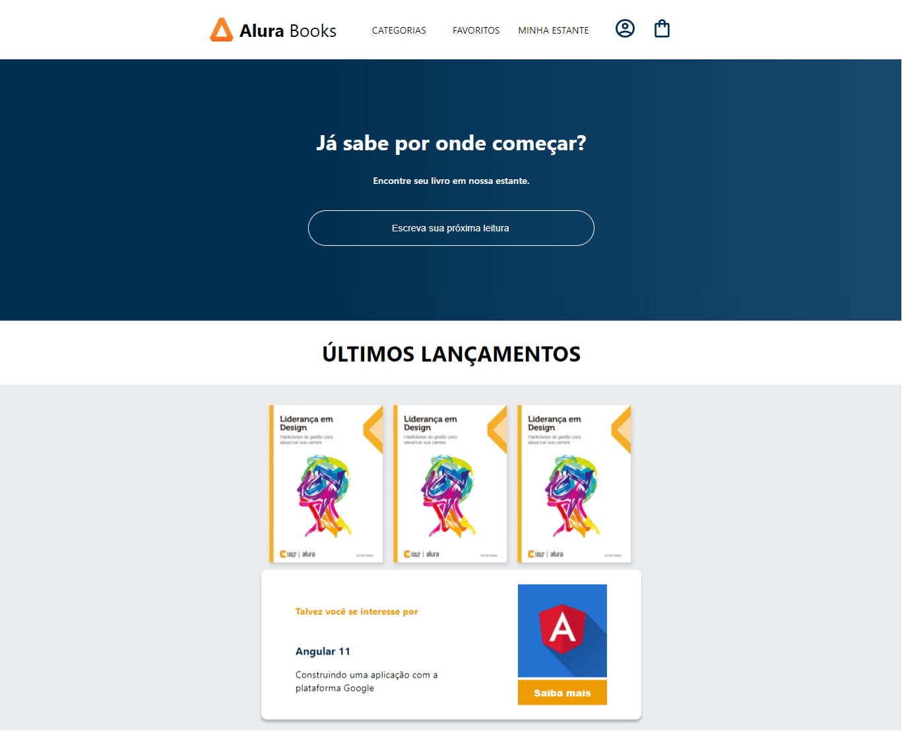

# FORMAÇÃO FULLSTACK JAVASCRIPT: CRIE UM PROJETO COM REACT E NODE.JS

OBS.: Esta formação está em **pré-lançamento**

---

## 📌 Sobre
  Todos os cursos da **Formação fullstack JavaScript com React e Node** ficam concentrados aqui.

---

| ✔️ | ⚫ | 🔵 | 🔶 | 🔴 | 
| --- | --- | --- | --- | --- |
| concluded | not started | in progress | paused | abandoned |

| 🟪 | 🟦 | 🟫  | 🟨 |
| --- | --- | --- | --- |
| Curso | Alura+ | Artigo | Podcast |

---

### 1️⃣ - Desenvolvendo uma página com React e API CRUD

| --- | --- | --- | 📘 Atividade | 🔗 PROJETO | REPOSITÓRIO | STATUS | PREVIEW |
| --- | --- | --- | --- | --- | --- | --- | --- |
| . | 1.1 | 🟪 | React: comece seu projeto fullstack | Alura Books | [🗂️](./comeceSeuProjetoFullstack/) | ✔️ |  |
| . | 1.2 | 🟪 | Node.js: continue seu projeto fullstack criando uma API com Express | API Alura Books | [🗂️](./criandoUmaAPIComExpress/) | ✔️ | ✖️ |

