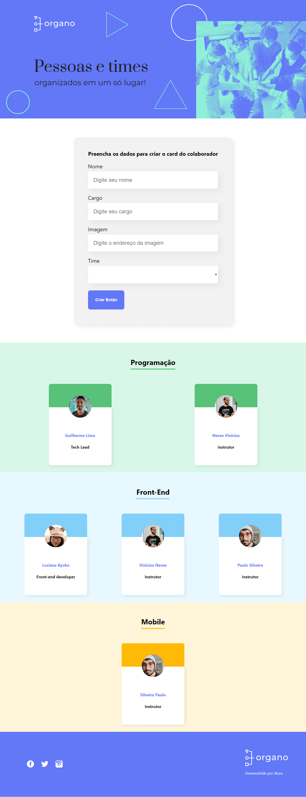
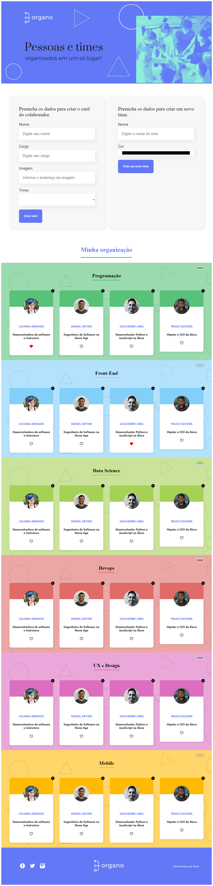

# FORMAÇÃO REACT COM JAVASCRIPT

---

## 📌 Sobre
  Todos os cursos da **Formação React com JavaScrip** ficam concentrados aqui.

---

| ✔️ | ⚫ | 🔵 | 🔶 | 🔴 | 
| --- | --- | --- | --- | --- |
| concluded | not started | in progress | paused | abandoned |

| 🟪 | 🟦 | 🟫  | 🟨 |
| --- | --- | --- | --- |
| Curso | Alura+ | Artigo | Podcast |

---

### 1️⃣ - Desenvolva uma aplicação do zero ao deploy

| --- | --- | 📘 Atividade | 🔗 PROJETO | REPOSITÓRIO | STATUS | PREVIEW |
| --- | --- | --- | --- | --- | --- | --- |
| 1.1 | 🟨 | Do Front End ao React | ✖️ | ✖️ | ✔️ | ✖️ | 
| 1.2 | 🟪 | React: desenvolvendo com JavaScript | Organo | [🗂️](./desenvolvendoComJS/) | ✔️ |   |
| 1.3 | 🟪 | React: como os componentes funcionam | Organo | [🗂️](./comoComponentesFuncionam/) | ✔️ |  |
| 1.4 | 🟫 | React, front-end e o mercado | - | - | ✔️ | ✖️ |
| 1.5 | 🟦 | Hooks do React: useState | - | - | ✔️ | ✖️ |

### 2️⃣ - Arquivos estáticos, roteamento e gestão de estados

| --- | --- | 📘 Atividade | 🔗 PROJETO | REPOSITÓRIO | STATUS |
| --- | --- | --- | --- | --- | --- |
| 2.1 | 🟪 | React com JS: lidando com arquivos estáticos | Alura Space | [🗂️](./lidandoComArquivosEstaticos/) | 🔵 |
| 2.2 | 🟪 | React com JS: desenvolvendo em React Router com JS | Ola Mundo | [🗂️](./reactRouterComJS/) | 🔵 |
| 2.3 | 🟪 | React com JS: gerenciamento de estados globais com ContextAPI | ✖️ | ✖️ | ⚫ |

### 3️⃣ - Praticando React Js e migrando para o Typescript

| --- | --- | 📘 Atividade | 🔗 PROJETO | REPOSITÓRIO | STATUS |
| --- | --- | --- | --- | --- | --- |
| 3.1 | 🟪 | React: praticando React com JS | ✖️ | ✖️ | ⚫ |
| 3.2 | 🟪 | React: migrando pra TypeScript | ✖️ | ✖️ | ⚫ |
