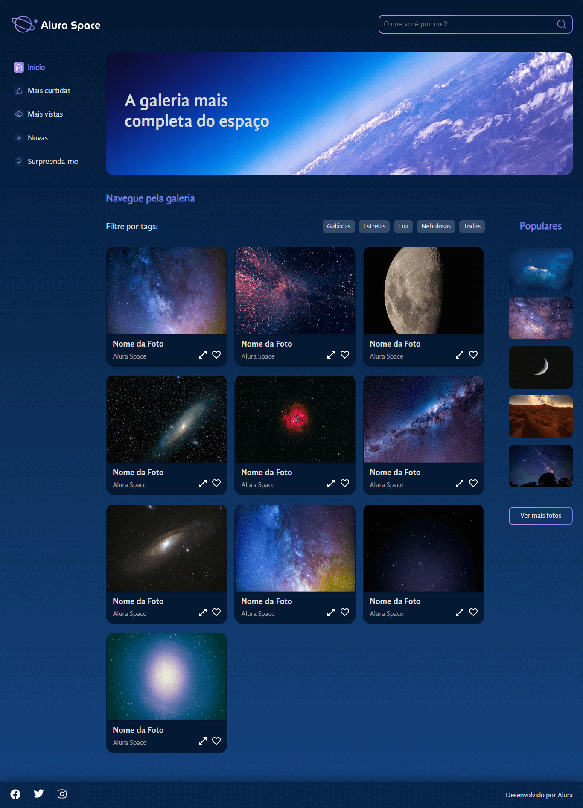

# CURSO - REACT COM JAVASCRIPT: LIDANDO COM ARQUIVOS ESTÁTICOS

---

## Aulas

  ✔️ concluded &nbsp;&nbsp;&nbsp;|&nbsp;&nbsp;&nbsp;
  ⚫ not started &nbsp;&nbsp;&nbsp;|&nbsp;&nbsp;&nbsp;
  🔵 in progress &nbsp;&nbsp;&nbsp;|&nbsp;&nbsp;&nbsp;
  🔶 paused &nbsp;&nbsp;&nbsp;|&nbsp;&nbsp;&nbsp;
  🔴 abandoned 

| Aula | Titulo | Status |
| --- | --- | --- |
| 1 | Explorando o projeto | ✔️ |
| 2 | Avançando nos componentes | ✔️ |
| 3 | Fontes e estilos | ✔️ |
| 4 | Lidando com imagens | ✔️ |
| 5 | Finalizando o projeto | ⚫ |

---

## Aprendizados

### Aula 01 - Explorando o projeto
<ul>
  <li>Iniciar o projeto com create-react-app;</li>
  <li>Limpar arquivos desnecessários;</li>
  <li>Criar uma estrutura de pastas dentro de src;</li>
  <li>Criar a página principal da aplicação;</li>
  <li>Importar imagens estáticas no React;</li>
  <li>Instalar o Sass no projeto;</li>
  <li>Vantagens de usar CSS modules.</li>
</ul>

### Aula 02 - Avançando nos componentes
<ul>
  <li>
    Criar o componente de Menu e boas práticas de organização de pastas;
  </li>
  <li>Como importar as imagens de ícones;</li>
  <li>A importância de manter um padrão de nomenclatura de classes;</li>
  <li>A escrever um HTML semântico;</li>
  <li>Inserir o banner da página;</li>
  <li>Utilizar o import da forma correta como sugere a documentação;</li>
  <li>O que é e como usar a extensão React Snippets.</li>
</ul>

### Aula 03 - Fontes e estilos
<ul>
  <li>Adicionar os arquivos GlobalStyle.scss e _variaveis.scss;</li>
  <li>Como usar o normalize.css;</li>
  <li>Como organizar e usar variáveis css;</li>
  <li>Como configurar os arquivos de fontes no projeto ;</li>
  <li>Como importar essas fontes usando o @fontface.</li>
</ul>

### Aula 04 - Lidando com imagens
<ul>
  <li>Como criar o componente de Tags e o de Galeria;</li>
  <li>Utilizar o map para percorrer o arquivo de dados e renderizar as imagens;</li>
  <li>Quando utilizar a pasta public;</li>
  <li>Como criar o componente de Card;</li>
  <li>As vantagens de componentizar a aplicação em diferentes níveis;</li>
  <li>Como criar o componente para exibir imagens populares.</li>
</ul>

### Aula 05 - Finalizando o projeto
<ul>
  <li>Como criar filtros de ordenação de imagens por Tag;</li>
  <li>Boas práticas de código;</li>
  <li>Como controlar estados e utilizar props em componentes;</li>
  <li>Como usar mixins para reaproveitamento de código e responsividade da página;</li>
  <li>As vantagens de utilizar absolute imports e como configurar caminhos absolutos;</li>
  <li>Como fazer o deploy da aplicação na vercel.</li>
</ul>

---

## 🎯 Projeto desenvolvido
Este é o screenshot do projeto que foi desenvolvido durante o curso:

  

