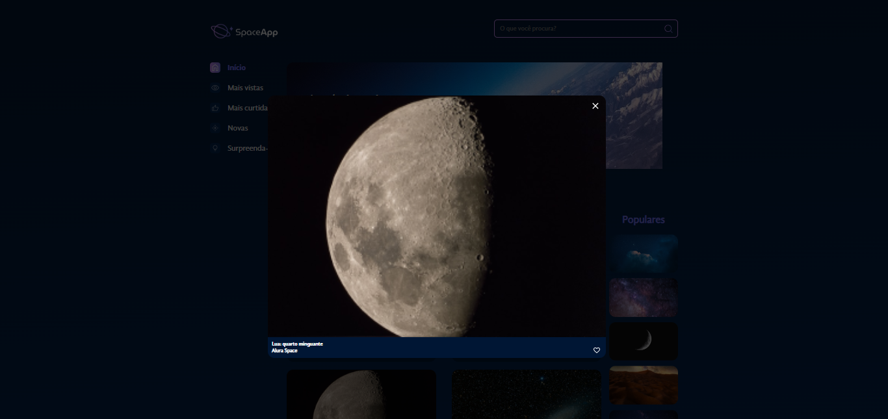

# Curso - React: estilize componentes com Styled Components e manipule arquivos estáticos

## Aulas

  ✔️ concluded &nbsp;&nbsp;&nbsp;|&nbsp;&nbsp;&nbsp;
  ⚫ not started &nbsp;&nbsp;&nbsp;|&nbsp;&nbsp;&nbsp;
  🔵 in progress &nbsp;&nbsp;&nbsp;|&nbsp;&nbsp;&nbsp;
  🔶 paused &nbsp;&nbsp;&nbsp;|&nbsp;&nbsp;&nbsp;
  🔴 abandoned 

| Aula | Titulo | Status |
| --- | --- | --- |
| 1 | Iniciando o projeto  | ✔️ |
| 2 | Componentes iniciais e fontes | ✔️ |
| 3 | Criando galeria | ✔️ |
| 4 | Uma modal de zoom | ✔️ |
| 5 | Favoritando imagens | ✔️ |

---

## Aprendizados

### Aula 01 - Iniciando o projeto 
<ul>
  <li>Utilizar o Vite para iniciar um projeto React;</li>
  <li>Instalar e implementar a biblioteca styled-components;</li>
  <li>Criar um fundo com gradiente;</li>
  <li>Normalizar o CSS com estilos globais.</li>
</ul>

### Aula 02 - Componentes iniciais e fontes
<ul>
  <li>Criar e estilizar o componente cabeçalho;</li>
  <li>Estruturar a barra lateral;</li>
  <li>Criar um item de lista que recebe um texto e uma imagem;</li>
  <li>Importar fontes e defini-las como padrão.</li>
</ul>

### Aula 03 - Criando galeria
<ul>
  <li>Montar um layout desktop;</li>
  <li>Estruturar o código de uma galeria de fotos com Flexbox;</li>
  <li>Trabalhar com tags dinamicamente;</li>
  <li>Importar fotos de um arquivo estático .json.</li>
</ul>

### Aula 04 - Uma modal de zoom
<ul>
  <li>Criar uma modal com o elemento Dialog;</li>
  <li>Trabalhar com eventos de seleção;</li>
  <li>Posicionar elementos de forma fixa e definir opacidade com rgba;</li>
  <li>Criar um estado que representa o elemento selecionado.</li>
</ul>

### Aula 05 - Favoritando imagens
<ul>
  <li>Iniciou o projeto do zero com o Vite;</li>
  <li>Criou todos os componentes de requisito do Figma;</li>
  <li>Publicou o resultado final na Vercel.</li>
  <li>criar uma aplicação do zero até o deploy!</li>
</ul>

---

## 🎯 Projeto desenvolvido
Este é o screenshot das telas projeto que foi desenvolvido durante o curso:

  
  

