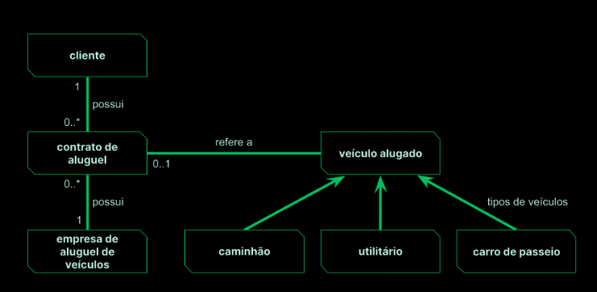
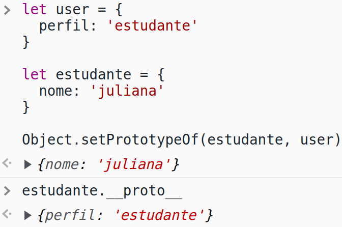

# Anotações do curso 

---
## Relembrando objetos
### Entendendo os paradigmas de programação
Paradigmas de programação são abordagens sobre como resolver problemas de programação, baseados em uma teoria ou um conjunto de princípios definidos. Em outras palavras, um paradigma normalmente se baseia em alguma teoria matemática ou computacional que propõe resolver determinado problema de uma forma específica.

Cada paradigma tem um conjunto de regras que especificam como os dados são tratados, a organização do sistema, a forma como o código é escrito, entre vários outros aspectos.

### Abstraindo conceitos com orientação a objetos
A orientação a objetos, especificamente, é um princípio que busca espelhar o mundo real por meio de uma estrutura de objetos com características e ações. Esses objetos, por sua vez, interagem uns com os outros.

Ou seja, a programação orientada a objetos parte de uma premissa de aproximar a modelagem do código do "mundo real" para o software. O propósito é transformar em software aspectos como uma pessoa, um produto ou um processo.

O intuito dessa abordagem é aproximar a abstração lógica de um programa ou aplicativo aos problemas da vida real que o software deve resolver.

Quando falamos em objetos, precisamos abstrair conceitos que existem na vida real.

Por exemplo, vamos pensar em um gato. Para abstrair um gato seguindo os conceitos da orientação a objetos, começamos dividindo este gato (não literalmente) em duas partes: características e comportamentos.

Como características desse gato, identificaremos:

O sexo;
A idade, que calculamos a partir da data de nascimento;
A cor da pelagem;
Alguns status como:
Ser castrado;
Estar vacinado;
Estar vermifugado.
Os comportamentos que este gato pode ter são ações. Nessa etapa, descreveremos o que o gato pode fazer:

Miar;
Comer:
Comer ração úmida;
Comer ração seca;
Dormir;
Se limpar com lambidas;
Brincar:
Brincar com bolinha;
Brincar com laser;
Brincar com fita;

Se transferirmos isso para o JavaScript, podemos utilizar um objeto literal, único para cada gato.

O objeto literal é a forma mais comum de se criar objetos em JavaScript, na qual temos uma variável e criamos o objeto a partir dela.
```
const gato = {
    nome: "Churrumina",
    nascimento: "25/11/2018",
    pelagem: "mesclada",
    status: {
        castrada: true,
        vacinada: true,
        vermifugada: true
    }
}
```

O objeto gato criado como exemplo acima possui diversas propriedades:

O nome, com o valor Churrumina do tipo string;
O nascimento, também do tipo string, com sua data de nascimento;
A pelagem, com o valor mesclada;
Um bloco status com uma lista de valores booleanos, que retornam verdadeiro ou falso (true ou false):
castrada, igual a true;
vacinada, igual a true e
vermifugado, igual a true.
Além das propriedades, esse objeto tem comportamentos. No JavaScript, podemos atribuir isso a uma função, como no exemplo miar abaixo, inserido dentro do objeto gato, abaixo do bloco status.

```
const gato = {
    nome: "Churrumina",
    nascimento: "25/11/2018",
    pelagem: "mesclada",
    status: {
        castrada: true,
        vacinada: true,
        vermifugada: true
    }
    miar: function() {
        console.log("miau")
    }
}
```

Nesse exemplo, a função miar chama um console.log com o som "miau" do gato em uma string. A partir disso, temos o comportamento de miar do gato, que será chamado com gato.miar().

### Criando modelos de objetos
Entendemos como abstrair conceitos da vida real em um objeto, transformando um gato de verdade em um gato de software.

Mas e se tivermos mais de um gato?

Vamos pensar, por exemplo, em uma clínica veterinária que atende vários gatos. Poderíamos ter um objeto literal, único para cada um dos gatos, conforme o exemplo abaixo.

```
const gato1 = {
    nome: "Churrumina",
    nascimento: "25/11/2018",
    pelagem: "mesclada",
    status: {
        castrada: true,
        vacinada: true,
        vermifugada: true
    }
}

const gato2 = {
    nome: "Wen Ning",
    nascimento: "25/01/2021",
    pelagem: "creme",
    status: {
        castrado: true,
        vacinado: true,
        vermifugado: true
    }
}
```

Temos o gato1, Churrumina, e o gato2, Wen Ning, cada qual com todas as suas características.

Mas se pensarmos em termos de um sistema, essa estrutura não é gerenciável nem prática. Não dá para criar variáveis e objetos literais para cada um dos gatos, cachorros e papagaios que temos em uma clínica veterinária.

Para resolver esse problema, podemos ter um modelo que se reflita no objeto que queremos criar.

Ou seja, podemos ter uma base para a estrutura gato, conforme o exemplo abaixo. Podemos criar esse modelo no formato de objeto literal mesmo, dizendo que modeloGato vai ter um nome, do tipo string, um nascimento, do tipo string, uma pelagem, do tipo string, e os status, que é um bloco com outro objeto, dentro do qual temos castrado, vacinado, e vermifugado, do tipo booleano.

```
const modeloGato = {
    nome: stringNome,
    nascimento: stringData,
    pelagem: stringPelagem,
    status: {
        castrado: boolCastrado,
        vacinado: boolVacinado,
        vermifugado: boolVermifugado
    },
}
```

Esse modelo é uma das bases da orientação a objetos. Com ele, não só abstraímos os conceitos da vida real e transformamos em estrutura de código, como abstraímos os próprios modelos.

A partir desses modelos, criarmos todos os nossos gatos, pessoas usuárias, produtos do nosso e-commerce, e assim por diante.

A partir de um modelo, conseguimos criar instâncias diferentes, ou seja, cópias de um objeto. No nosso exemplo, a partir do modeloGato, criamos abaixo um objeto com os dados do gato Churrumina e outro com os dados do gato Wen Ning.

```
[
    {
        nome: "Churrumina",
        nascimento: "25/11/2018",
        pelagem: "mesclada",
        status: {
            castrado: true,
            vacinado: true,
            vermifugado: true
        },
    },
    {
        nome: "Wen Ning",
        nascimento: "25/01/2021",
        pelagem: "creme",
        status: {
            castrado: true,
            vacinado: true,
            vermifugado: true
        },
    }
]
```

Um dos fundamentos explorados da orientação a objetos é conseguir fazer essa abstração que pode ser reaproveitada para vários gatos, clientes, produtos e outras entidades

---

##  paradigmas de programação
Além do paradigma orientado a objetos, temos também outras formas de lidar e organizar os programas. Uma forma muito comum de categorizar esses paradigmas é dividi-los entre paradigmas **imperativos** ou **declarativos**.

Os **paradigmas imperativos** são aqueles que usam afirmações para alterar o estado de um programa, da mesma forma como o modo verbal imperativo no português expressa um comando ou ordem para ser executada. Essa categoria se preocupa com o **“como”** uma tarefa vai ser executada, o seu passo a passo e a sequência dessas etapas. Alguns dos paradigmas que se encaixam aqui são os seguintes:

- Estrutural
- Procedural
- Orientado a objetos

Um exemplo que mostra o paradigma imperativo é a implementação da seguinte função que recebe um vetor e retorna outro vetor com cada um dos valores dobrado:
```
function dobra(vetor){
    let resultados = [];
    for (let i = 0; i < vetor.length ; i++){
        resultados.push(arr[i] * 2);
}
return resultados;
}
```

Podemos notar que passamos as instruções de como percorrer o vetor, qual operação fazer e o que devemos adicionar ao resultado.

Uma outra categoria de paradigma é o **declarativo**. Podemos dizer que uma característica dele é expressar a lógica de um processo sem descrever o seu controle de fluxo. Ou seja, é associado a **“o quê”** uma tarefa vai resultar ou retornar. Um paradigma que pode se encaixar nessa categoria é o **paradigma funcional**.

Uma implementação declarativa do mesmo problema de dobrar os valores de um vetor pode ser feita da seguinte forma:
```
function dobra(vetor){
  return vetor.map((item) => item * 2);
}
```

Podemos observar que não foi necessário explicitar como iterar sobre o laço de repetição ou atribuir os novos valores.

No cotidiano temos diversos outros exemplos de afirmações que podem ser consideradas declarativas, como arquivos HTML:
```
<h1> Programação Declarativa</h1>
<p> Estou declarando como quero que o texto apareça, e não dizendo para o computador como renderizar um texto</p>
```

Ou até mesmo as queries SQL, nas quais apenas dizemos qual resultado esperamos, sem especificar como a busca deve ser feita:
```
SELECT * FROM Alunos WHERE Escola=’Alura’;
```

O JavaScript e algumas outras linguagens podem utilizar mais de um paradigma. É comum ouvir o termo “multiparadigma” quando nos referimos a esse tipo de linguagem, e isso traz alguns benefícios, pois permite perfis diferentes de desenvolvedores e sistemas utilizarem uma linguagem em comum.

Claro que um paradigma não é necessariamente melhor que o outro, mas dependendo das circunstâncias podemos utilizar um que seja mais otimizado para determinada aplicação. Algumas funcionalidades precisam alterar o estado de uma aplicação, não podendo ser escritas de forma declarativa, assim como os códigos declarativos que utilizamos podem ter uma implementação imperativa por baixo dos panos.

---

## a linguagem UML
Existe uma forma muito prática de ilustrar sistemas, controles de fluxo e outros comportamentos chamado UML. A UML é a Linguagem de Modelagem Unificada - do inglês Unified Modeling Language.

Ela consiste na padronização de algumas notações para facilitar o entendimento entre os times de desenvolvimento que eventualmente irão lidar com um determinado sistema.

Um dos diagramas mais comuns de ser representado utilizando a UML é o diagrama de classe. A função dele é representar as estruturas e relações entre as classes de um projeto e interfaces com outros sistemas. Aqui está um exemplo:
<p align="center">
  
</p>

Neste diagrama, representamos a existência de uma relação por uma reta e as associações são indicadas por setas. Os números que acompanham as retas indicam a quantidade de itens que estão se relacionando. No exemplo, um cliente pode possuir 0 ou mais contratos de aluguel, enquanto um contrato de aluguel só pode se referir a 0 ou 1 veículo alugado.

Existem outras versões de diagramas de classe que incluem, por exemplo, os tipos de variáveis dos dados associados, informações sobre tipos de dados abstratos, relações de herança e composição de classes e métodos que são implementados pelas classes.

Atualmente, a UML é mantida por um consórcio internacional que regula esse padrão. Existem diversos programas disponíveis que nos permitem descrever em um código próprio um diagrama e exportar as imagens que ilustram o sistema, como o PlantUML.

---

##  call e apply
### call()
O método call() executa a função passando valores e parâmetros específicos para serem usados como contexto do this, ou seja, é possível atribuir um this diferente do contexto atual ao executar a função.

Um exemplo de uso de call() para especificar o contexto de this:
```
function exibeInfos() {
 console.log(this.nome, this.email)
}

const user = {
 nome: 'Mariana',
 email: 'm@m.com'
}

exibeInfos.call(user)
```

Fazendo com que a função seja executada em determinado contexto, mesmo após ser instanciada:

```
function User(nome, email) {
 this.nome = nome
 this.email = email

 this.exibeInfos = function(){
   console.log(this.nome, this.email)
 }
}

const newUser = new User('mariana', 'm@m.com')
```

```
const outroUser = {
 nome: 'Rodrigo',
 email: 'r@r.com'
}

newUser.exibeInfos() //mariana m@m.com
newUser.exibeInfos.call(outroUser) //Rodrigo r@r.com
```

Também é possível passar parâmetros para call(), como no próximo exemplo.

Temos uma função que monta uma determinada mensagem a partir dos parâmetros nome e email. Se quiséssemos vincular os dados da mensagem a um objeto com dados de usuários, podemos usar call() passando como primeiro parâmetro o contexto a ser considerado como this (no caso, objeto user) e a partir do segundo parâmetro definimos quais os argumentos.

```
function exibeMensagem(nome, email) {
 console.log(`usuário: ${nome}, email ${email}`)
}
 const user = {
 nome: 'Mariana',
 email: 'm@m.com',
 executaFuncao: function(fn) {
   fn.call(user, this.nome, this.email)
 }
}

user.executaFuncao(exibeMensagem) //usuário: Mariana, email m@m.com
```

Nesse caso, a função que será executada também está sendo passada como parâmetro de executaFuncao e usamos call() para “chamar” a função com um contexto (this) específico e também argumentos específicos.

O método call() pode ser utilizado para se implementar herança utilizando funções em vez da sintaxe de classe. 


### apply()
O método apply() funciona de forma semelhante ao call(), porém recebe a lista de argumentos em um array:
```
function exibeMensagem(nome, email) {
 console.log(`usuário: ${nome}, email ${email}`)
}
 const user = {
 nome: 'Mariana',
 email: 'm@m.com',
 executaFuncao: function(fn) {
   fn.apply(user, [this.nome, this.email])
 }
}
 user.executaFuncao(exibeMensagem) //usuário: Mariana, email m@m.com
```

Usando arrays, é possível passar os argumentos via variável ou até mesmo usando a propriedade arguments que existe internamente em todo objeto.


---

## Function vs Arrow Function
Por que não utilizamos arrow function na criação dos nossos métodos?

Em um primeiro momento, todas as três formas de criação de função parecem funcionar de forma bem similar. Porém, as arrow functions diferem da function usual em alguns pontos, sendo o mais importante para nós nesse momento a questão do this.

### O problema do this
Caso você precise relembrar como funcionam as três formas de se escrever funções em JavaScript, veja o tópico seguinte “Relembrando os tipos de função” (logo abaixo).

A primeira diferença entre a declaração de função e as expressões de função é o hoisting. Mas, além do hoisting, existe outra diferença principal entre declaração de função e arrow function: ao contrário das funções normais, arrow functions herdam automaticamente o contexto de onde foram criadas e não têm seu próprio “contexto de invocação”. Ou seja, não podem ser ligadas a contextos específicos com this e nem fazer uso dos métodos bind(), call() e apply().

Arrow functions também não possuem a propriedade prototype e por isso não podem ser usadas como funções construtoras - assunto que veremos em seguida. Por este motivo, não usamos arrow functions em nenhum momento para a criação de métodos durante o curso.

### Relembrando os tipos de função
A primeira versão, mais “clássica”, é muito parecida com outras linguagens:
```
function soma(num1, num2) {
 return num1 + num2;
}
```

É a chamada “declaração de função”.

A segunda forma atribui a função a uma variável, funcionalidade que não é tão comum em outras linguagens:
```
const soma = function(num1, num2) {
 return num1 + num2;
}
```

Chamamos essa forma de “expressão de função”.

A terceira e última forma é a arrow function ou “função de seta”, caracterizada pelo operador =>:
```
const soma = (num1, num2) => {
 return num1 + num2;
}
```

Ou, no caso de blocos de código com apenas uma linha, podemos omitir o return e as chaves {}:

```const soma = (num1, num2) => num1 + num2;```

Bem mais curto!

A arrow function também é uma expressão de função.

### E quais são as diferenças entre elas, além do this?
A primeira diferença entre as três formas é um pouco mais teórica. Funções criadas como declaração recebem um identificador (ou seja, um nome), e funções criadas como expressão são consideradas anônimas - estas funções são atribuídas a variáveis e é através dessas variáveis que conseguimos chamá-las e executá-las.

Na prática, a diferença se dá no contexto do carregamento do código. Declarações de função têm seu código lido antes da execução de qualquer instrução, pois o interpretador “puxa” para as primeiras linhas do arquivo todas as variáveis e todas as declarações de função, deixando seus códigos e dados “carregados” para, aí sim, começar a executar os códigos. A esta ação se dá o nome de ”hoisting”, que significa algo como “içar”, pois as funções e variáveis são “içadas” para o topo do arquivo e lidas primeiro.

Já as expressões de função, que são anônimas, não passam pelo processo de hoisting e têm seu conteúdo interpretado apenas no momento da execução. Assim, o interpretador (seja o Node.js ou um navegador) não consegue executar a função sem ter lido seu conteúdo antes.

Por exemplo, o código abaixo (uma declaração de função) executa normalmente:
```
console.log(soma(1, 1)) //2

//é possível executar a função antes de declará-la no código
function soma(num1, num2) {
 return num1 + num2;
}
```

Porém o código abaixo (uma expressão de função) não executa:
```
console.log(soma(1, 1)) //erro

//ReferenceError: Cannot access 'soma' before initialization
const soma = function(num1, num2) {
 return num1 + num2;
}
```
O mesmo erro acima ocorreria com uma arrow function

---

## __proto__ vs prototype
Durante nossos estudos de JavaScript é normal toparmos com os protótipos de duas formas diferentes, através da propriedade __proto__ ou do objeto prototype que vemos em todos os objetos. Afinal, qual a diferença entre eles e quando se usa cada um?

Para entender melhor essa diferença, vamos testar alguns códigos:
```
let user = {
 perfil: 'estudante'
}

let estudante = {
 nome: 'juliana'
}

Object.setPrototypeOf(estudante, user)
```

No trecho acima, definimos dois objetos, com propriedades diferentes, e estabelecemos que o objeto user será usado como protótipo para o objeto estudante. Podemos testar esse código direto no terminal:
```
console.log(estudante.nome) // 'juliana'
console.log(estudante.perfil) //'estudante'
```

Ou seja, o objeto estudante, além da propriedade nome, também tem a propriedade perfil, trazida do protótipo user.

É possível acessar __proto__ de estudante, porém, para isso, devemos copiar o código acima e executá-lo no console do navegador, pois o módulo console do Node.js funciona de uma forma um pouco diferente e não vai acessar essa propriedade.

<p align="center">
  
</p>

Se adicionarmos mais uma propriedade ao objeto user, essa propriedade entrará também como protótipo do objeto estudante:

<p align="center">
  
</p>

Quando usamos objetos e funções para trabalhar com orientação a objetos com JavaScript, os objetos criados não são instâncias diferentes (ou seja, cópias do objeto-base) e sim referências a um mesmo objeto que está sendo delegado aos objetos que o usam como protótipo.

Agora vamos ver outro exemplo, dessa vez utilizando new para criar um novo objeto:
```
function User() {}
User.prototype.perfil = 'estudante'
let estudante = new User()
```

Testando no próprio terminal:

```
console.log(estudante.perfil) //'estudante'
```

No caso acima, a palavra-chave new vai criar um novo objeto simples e definir, na propriedade prototype desse objeto recém-criado, as propriedades de protótipo que encontrar em User. O prototype é criado automaticamente e existe como propriedade apenas em funções, para quando queremos usar determinada função como construtor usando new.

Vamos fazer um último teste, copiando a função User() criada acima e executando no console do navegador:

<p align="center">
  
</p>

Se tentarmos acessar as propriedades prototype e __proto__ de estudante, obtemos os seguintes retornos:
<p align="center">
  
</p>

Em resumo:

__proto__ é uma propriedade que todos os objetos têm e que aponta para o protótipo que foi definido para aquele objeto.

prototype é uma propriedade da função que é definida como protótipo quando usamos new para criar novos objetos.

Você também pode ter notado que alguns objetos também possuem uma propriedade chamada [[Prototype]]. Esta é uma propriedade interna que cada instância de um objeto possui e que aponta (como um ponteiro) para a propriedade prototype da função que está sendo usada como protótipo. Quando criamos um novo objeto usando new, a propriedade prototype do construtor (como vimos acima) é “linkada” à essa propriedade [[Prototype]] da nova instância criada.

Existem diversos métodos internos do JavaScript para verificar as propriedades de um construtor e também das instâncias criadas através dele.

---

## um resumo sobre protótipos
Aprendemos vários aspectos da herança de protótipos durante a aula. Vamos resumir alguns deles aqui e colocar alguns pontos extras:

### Protótipo vs prototype
Praticamente todos os dados criados em JavaScript (objetos, arrays etc.) têm um protótipo, porém apenas alguns deles têm a propriedade prototype. São estes objetos que contêm a propriedade prototype que acessamos com Object.prototype, Array.prototype, entre outros, durante o vídeo, que definem os protótipos para todos os outros acima na cadeia.

Ou seja, todos os objetos criados a partir de Object, Array, String etc. têm um protótipo que foi “herdado” destes, mas não necessariamente têm uma propriedade prototype.

### Cópia vs referência
Os métodos e propriedades não são copiados de um objeto para outro na cadeia de protótipos. Eles são acessados pelo interpretador ao percorrer a cadeia e os métodos executados de acordo com o this, ou seja, o contexto em que o método foi executado.

### __proto__ será descontinuado
O uso de __proto__ durante a aula é apenas para dar exemplo e acessar a cadeia de protótipos. Esta é uma propriedade “assessora” que serve para “expor” o protótipo dos objetos e está em processo de ser descontinuada. 

### Não altere o prototype
Não é recomendável alterar diretamente o prototype, pois alterar diretamente as regras de herança de qualquer objeto afeta a performance do código em qualquer interpretador, tanto no Node.js quanto em navegadores. Vamos ver como criar objetos de acordo com as boas práticas do JavaScript em seguida.

### Cuidado com a performance
Todas as propriedades de uma cadeia de protótipos são enumeradas, e o tempo que o interpretador leva para pesquisar uma propriedade, desde o nível mais alto na cadeia, pode ser longo e impactar o desempenho. Além disso, se o código tentar acessar uma propriedade não existente, vai percorrer toda a cadeia durante a busca. Assim, não é uma boa prática criar longas cadeias de protótipos.

---

## factory functions
Uma factory function (“função fábrica”) é como chamamos, em JavaScript, uma função que retorna um objeto.

Exemplo de factory function:
```
function criaUser(nome, email) {
 return {
   nome,
   email,
   exibeInfos() {
     return `${nome}, ${email}`
   }
 }
}
```

Perceba que, um pouco diferente do que foi feito na aula, não se trata de um objeto literal, mas sim de uma função que retorna (através da palavra-chave return) um objeto.

A função acima, quando executada com os parâmetros necessário, vai retornar um objeto com duas propriedades (nome e email) e um método interno (exibeInfos()):

```
const newUser = criaUser('Rodrigo', 'r@r.com')
console.log(newUser)
console.log(newUser.exibeInfos())
```

O retorno esperado no terminal:

```
{
  nome: 'Rodrigo',
  email: 'r@r.com',
  exibeInfos: [Function: exibeInfos]
}

Rodrigo, r@r.com
```

As factory functions são diferentes das funções construtoras. Veja um exemplo de função construtora, como fizemos anteriormente durante a aula:
```
function User(nome, email) {
 this.nome = nome
 this.email = email

 this.exibeInfos() {
   return `${nome}, ${email}`
 }
}
```

```
const newUser = new User('Mariana', 'm@m.com')
console.log(newUser)
console.log(newUser.exibeInfos())
```

O retorno no console é praticamente o mesmo, com a exceção de que agora exibeInfos() é uma função anônima e o objeto é explicitamente uma instância de User:
```
User {
  nome: 'Mariana',
  email: 'm@m.com',
  exibeInfos: [Function (anonymous)]
}

Mariana, m@m.com
```

No caso da factory function não há perda de contexto na execução dos métodos internos.

### Quais são as diferenças e qual devo usar?
Não há consenso, pois ambas têm vantagens e desvantagens. A sintaxe da função construtora é mais confortável para quem está acostumado com o uso de classes; já a factory function é mais flexível a respeito do tipo de objeto que será retornado.

Boa parte dos frameworks e bibliotecas do Node.js atualmente vão trabalhar com classes ou construtores, instanciados com new.