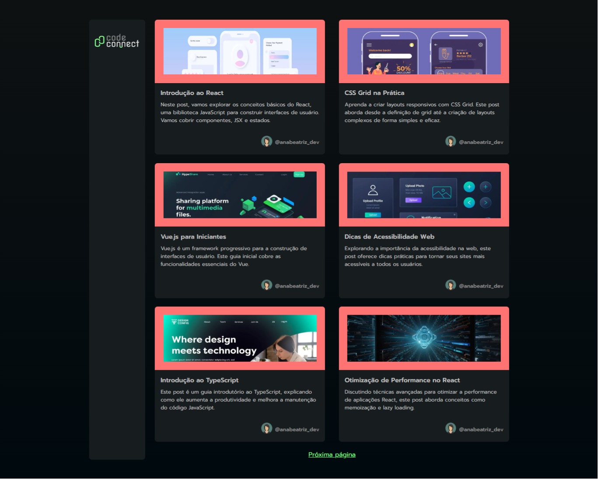

# Curso - Next.js: construindo com Server ActionsReact: criando um Design System com TailwindCSS

## Aulas

  ✔️ concluded &nbsp;&nbsp;&nbsp;|&nbsp;&nbsp;&nbsp;
  ⚫ not started &nbsp;&nbsp;&nbsp;|&nbsp;&nbsp;&nbsp;
  🔵 in progress &nbsp;&nbsp;&nbsp;|&nbsp;&nbsp;&nbsp;
  🔶 paused &nbsp;&nbsp;&nbsp;|&nbsp;&nbsp;&nbsp;
  🔴 abandoned 

| Aula | Titulo | Status |
| --- | --- | --- |
| 1 | Evoluindo o banco de dados  | ✔️ |
| 2 | Server Actions e Client Components | ✔️ |
| 3 | Adicionando comentários | ✔️ |
| 4 | Respondendo comentários | ✔️ |
| 5 | Finalizando a aplicação | ✔️ |

---

## Aprendizados

### Aula 01 - Evoluindo o banco de dados 
<ul>
  <li>Levantar um container docker do postgres</li>
  <li>Configurar o ambiente de desenvolvimento do Prisma</li>
  <li>Modelar entidades e relacionamentos no Prisma</li>
  <li>Executar migrations para inicializar o banco de dados.</li>
</ul>

### Aula 02 - Server Actions e Client Components
<ul>
  <li>Obter dados utilizando o método findMany;</li>
  <li>Incluir relacionamentos de forma automática via Prisma;</li>
  <li>Configurar e executar seed de dados com o prisma db seed</li>
</ul>

### Aula 03 - Adicionando comentários
<ul>
  <li>Paginar dados com o Prisma;</li>
  <li>Aplicar conceitos de take e skip usando queries do Prisma;</li>
  <li>Analisar e resolver bugs baseado relacionados ao operador soma entre number e string.</li>
</ul>

### Aula 04 - Respondendo comentários
<ul>
  <li>Obter dados utilizando o método findFirst;</li>
  <li>Se recuperar de erros não esperados;</li>
  <li>Customizar página 404 do Next.js;</li>
  <li>Redirecionar a navegação do Next.js no lado do servidor.</li>
</ul>

### Aula 05 - Finalizando a aplicação
<ul>
  <li>Evoluir queries e aplicar cláusulas WHERE;</li>
  <li>Criar Links utilizando o objeto de configuração;</li>
  <li>Cuidar da infraestrutura do projeto, customizando scripts de build;</li>
  <li>Vincular um banco de dados Postgres a um projeto na Vercel.</li>
</ul>

---

## 🎯 Projeto desenvolvido
Este é o screenshot do projeto que foi desenvolvido durante o curso:

  

 