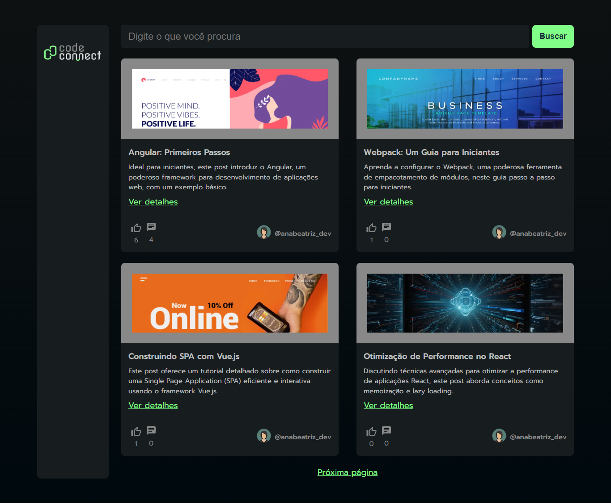
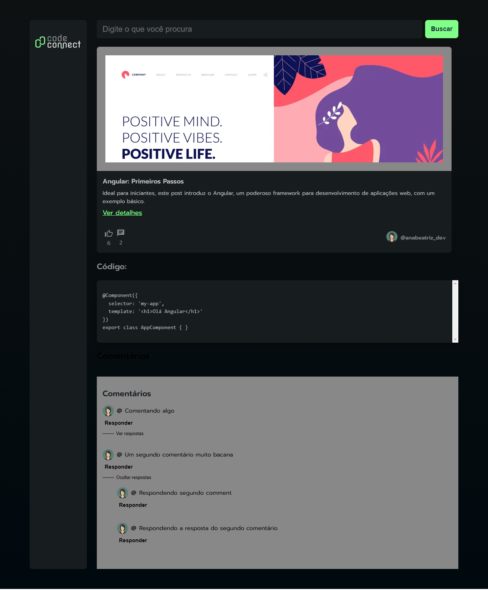

# Curso - Next.js: construindo com Server Actions

## Aulas

  ✔️ concluded &nbsp;&nbsp;&nbsp;|&nbsp;&nbsp;&nbsp;
  ⚫ not started &nbsp;&nbsp;&nbsp;|&nbsp;&nbsp;&nbsp;
  🔵 in progress &nbsp;&nbsp;&nbsp;|&nbsp;&nbsp;&nbsp;
  🔶 paused &nbsp;&nbsp;&nbsp;|&nbsp;&nbsp;&nbsp;
  🔴 abandoned 

| Aula | Titulo | Status |
| --- | --- | --- |
| 1 | Evoluindo o banco de dados  | ✔️ |
| 2 | Server Actions e Client Components | ✔️ |
| 3 | Adicionando comentários | ✔️ |
| 4 | Respondendo comentários | ✔️ |
| 5 | Finalizando a aplicação | ✔️ |

---

## Aprendizados

### Aula 01 - Evoluindo o banco de dados 
<ul>
  <li>Evoluir o banco de dados de uma aplicação existente, utilizando o Prisma;</li>
  <li>Criar auto relacionamentos;</li>
  <li>Criar queries do Prisma usando o increment.</li>
</ul>

### Aula 02 - Server Actions e Client Components
<ul>
  <li>Revalidar o cache do Next com a função revalidatePath;</li>
  <li>Pré-definir parâmetros usando o método bind;</li>
  <li>Implementar client components e utilizar o hook useFormStatus.</li>
</ul>

### Aula 03 - Adicionando comentários
<ul>
  <li>Implementar o useImperativeHandle;</li>
  <li>Combinar Server Actions e Client Components;</li>
  <li>Utilizar o método create do Prisma.</li>
</ul>

### Aula 04 - Respondendo comentários
<ul>
  <li>Manipular a inclusão de comentários aninhados;</li>
  <li>Operador ?? (Nullish Coalescing Operator);</li>
  <li>Pensamento crítico para organizar a estrura visual em componentes reaproveitáveis.</li>
</ul>

### Aula 05 - Finalizando a aplicação
<ul>
  <li>Implementar uma rota GET utilizando o Route Handler;</li>
  <li>Buscar dados no servidor a partir do Client Component;</li>
  <li>Manipular includes aninhados do Prisma.</li>
</ul>

---

## 🎯 Projeto desenvolvido
Este é o screenshot do projeto que foi desenvolvido durante o curso:

  
  

