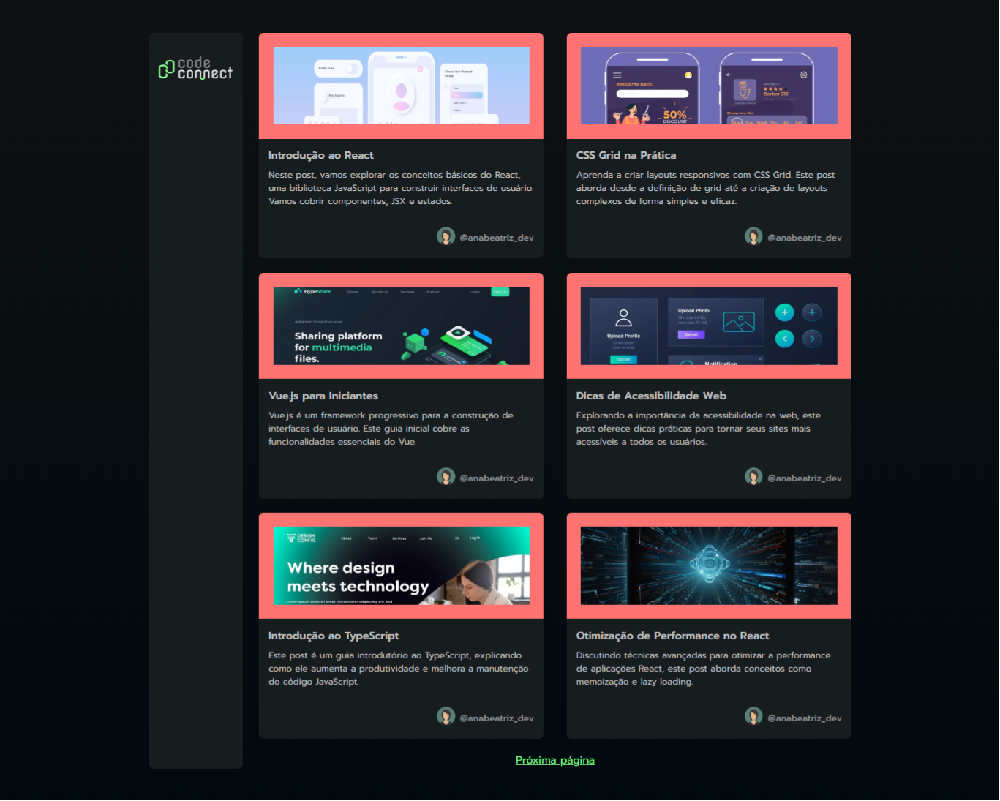
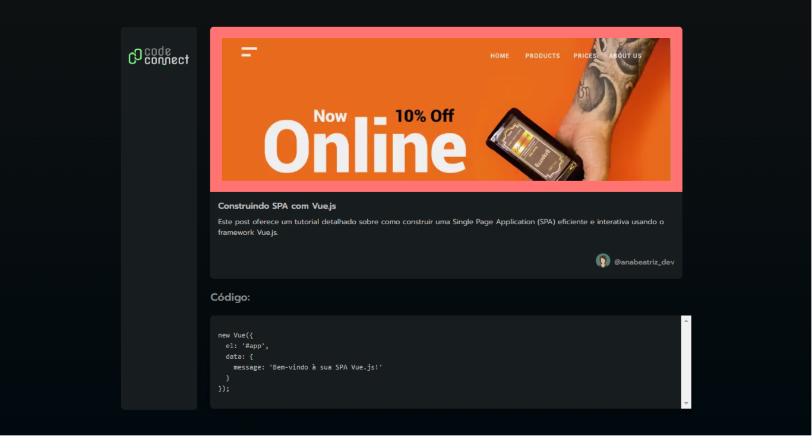

# Curso - Next.js: conheça o framework React

## Aulas

  ✔️ concluded &nbsp;&nbsp;&nbsp;|&nbsp;&nbsp;&nbsp;
  ⚫ not started &nbsp;&nbsp;&nbsp;|&nbsp;&nbsp;&nbsp;
  🔵 in progress &nbsp;&nbsp;&nbsp;|&nbsp;&nbsp;&nbsp;
  🔶 paused &nbsp;&nbsp;&nbsp;|&nbsp;&nbsp;&nbsp;
  🔴 abandoned 

| Aula | Titulo | Status |
| --- | --- | --- |
| 1 | Criando o projeto | ✔️ |
| 2 | Criando um card para os posts | ✔️ |
| 3 | Obtendo dados da API | ✔️ |
| 4 | Paginando dados | ✔️ |
| 5 | Páginas dinâmicas | ✔️ |

---

## Aprendizados

### Aula 01 - Criando o projeto
<ul>
  <li>Criar aplicações Next.js utilizando o npx;</li>
  <li>Estilizar componentes utilizando CSS Modules;</li>
  <li>Lidar com imagens na pasta public;</li>
  <li>Otimizar o uso das imagens utilizando o componente Image do Next.js.</li>
</ul>

### Aula 02 - Criando um card para os posts
<ul>
  <li>Utilizar imagens remotas no componente Image;</li>
  <li>Configurar as props obrigatórias do componente Image;</li>
  <li>Importar fontes do Google;</li>
  <li>Analisar os logs e reagir a avisos de configurações do Next.js que estão depreciadas.</li>
</ul>

### Aula 03 - Obtendo dados da API
<ul>
  <li>Subir uma API usando o json-server;</li>
  <li>Obter dados do lado do Servidor;</li>
  <li>Configurar o winton como o logger da Code Connect.</li>
</ul>

### Aula 04 - Paginando dados
<ul>
  <li>Obter dados da query string utilizando searchParams;</li>
  <li>Paginar os posts respeitando a interface da API;</li>
  <li>Exibir e controlar os comandos de paginação, baseado na resposta do backend.</li>
</ul>

### Aula 05 - Páginas dinâmicas
<ul>
  <li>Configurar páginas com parâmetros dinâmicos usando Next.js;</li>
  <li>Implementar a conversão de markdown para HTML;</li>
  <li>Configurar as libs remark e remark-html.</li>
</ul>

---

## 🎯 Projeto desenvolvido
Este é o screenshot das telas Code Connect que foi desenvolvido durante o curso:

  
  

