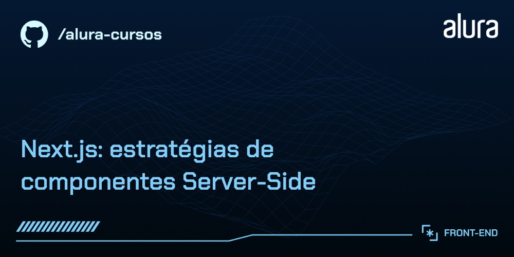

# Título do Curso: Next.js: estratégias de componentes Server-Side

Curso prático de Next.js focado em Server-Side Rendering (SSR) e desenvolvimento de aplicativos web modernos.

## 🔨 Funcionalidades do Projeto

O curso abrange o desenvolvimento de um blog dinâmico com funcionalidades como:

- Listagem de posts com paginação.
- Exibição detalhada de cada post.
- Renderização do lado do servidor.
- Roteamento com App Router.
- Integração com APIs usando fetch

## ✔️ Técnicas e Tecnologias Utilizadas

As principais técnicas e tecnologias abordadas são:

- `Next.js`: Framework para React com recursos de SSR.
- `Fetch API`: Realizar requisições HTTP para buscar dados.
- `remark`: Biblioteca para processamento de Markdown em HTML.
- `winston`: Logging avançado com diferentes níveis e transportes.
- `React Components`: Desenvolvimento de componentes reutilizáveis.
- `CSS Modules`: Estilização modular e escopada.
- `Client-Side Navigation`: Navegação eficiente entre páginas com Next.js.

## 🎯 Desafios do Curso

Implementação de funcionalidades avançadas, como:

- Consumo de uma API de posts.
- Renderização de Markdown em componentes React.
- Gerenciamento de logs e erros.

## 🛠️ Abrir e Rodar o Projeto

Após baixar o projeto, você pode abrir com seu editor de código preferido. Siga estes passos:

- Abra o terminal no diretório do projeto.
- Execute `npm install` para instalar as dependências.
- Inicie o servidor de desenvolvimento com `npm run dev`.
- Acesse `http://localhost:3000` no navegador para ver o projeto.

## 📚 Mais Informações do Curso

Interessado em aprofundar seus conhecimentos em Next.js e SSR? [Acesse o curso]() que desenvolve este projeto desde o início!
