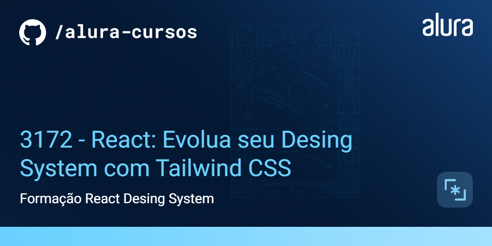

# Alfabit

A Alfabit é uma inovadora empresa de tecnologia dedicada a fornecer soluções criativas e eficientes para seus clientes. Reconhecendo a importância do design consistente e intuitivo em todas as suas plataformas e produtos, a Alfabit decidiu investir em um design system de ponta.

## 🛠️ Instalação

```bash
$ npm install
$ //ou
$ yarn add
```

## 🔨 Projeto

O [Figma dessa aplicação você encontra aqui](https://www.figma.com/file/h86gUvqUXTKwgr6tVYinLT/React%3A-Design-System-com-Tailwind?type=design&node-id=0-1&t=GuaFV9cp30SS2di9-0).

## ✔️ Técnicas e tecnologias utilizadas

Se liga nessa lista de tudo que usaremos nesse curso:

- `React`
- `Next js`
- `Tailwind CSS`
- `Storybook`
- `Class Variance Authority (cva)`
- `Headless UI`
- `classnames`
- `GitHub`
- `Figma`

E muito mais!

## 🛠️ Abrir e rodar o projeto

Após clonar ou baixar o projeto, instale as dependências, abra na sua IDE favorita (eu recomendo o VS Code) e digite no terminal `npm run storybook` e acesse a url mostrada no terminal.

## 📚 Mais informações do curso

O design system da Alfabit é uma abordagem abrangente e estruturada que reúne diretrizes, padrões e componentes de design em um conjunto coeso. Essa iniciativa permite que a empresa crie produtos digitais com uma identidade visual unificada, oferecendo uma experiência do usuário excepcionalmente intuitiva e agradável.
