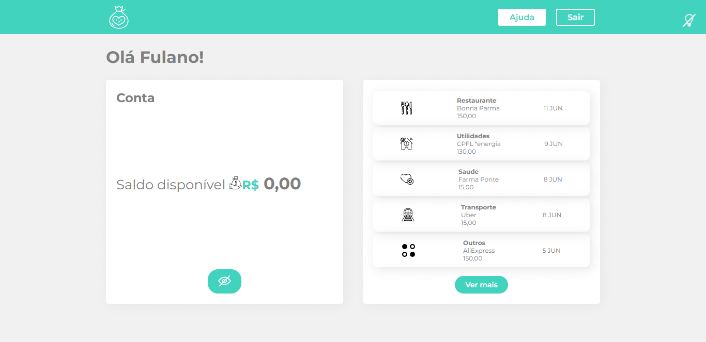
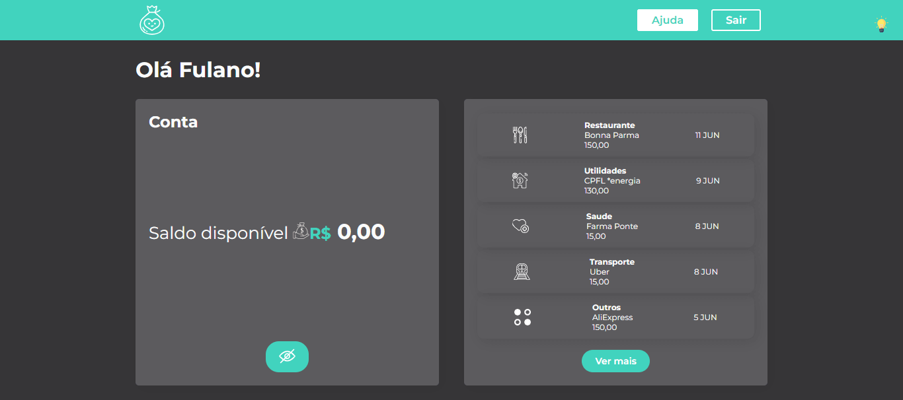

  <a href="https://">Link</a> &nbsp;&nbsp;&nbsp;|&nbsp;&nbsp;&nbsp;
  <a href="#-Learnings">Learnings</a> &nbsp;&nbsp;&nbsp;|&nbsp;&nbsp;&nbsp;
  <a href="#-Preview">Preview</a> &nbsp;&nbsp;&nbsp;|&nbsp;&nbsp;&nbsp;

---

## 🚀 Learnings
### Class 01 - Styled-Components
<ul>
  <li>Como instalar o Styled Components dentro do projeto</li>
  <li>Como criar um componente com o Styled Components</li>
  <li>Sobre a geração automática de classes</li>
  <li>Como transferir código CSS para meu componente estilizado</li>
</ul>

### Class 02 - Topicos Basicos
<ul>
  <li>Usando o reset global do projeto com o Styled Components</li>
  <li>Criando estilos globais para a aplicação</li>
  <li>Importando fontes do google para o projeto</li>
  <li>Criando variáveis para cores do projeto</li>
  <li>Utilizando propriedades em Componentes estilizados</li>
</ul>

### Class 03 - Refatoracoes
<ul>
  <li>Porque usar inline styles é algo ruim</li>
  <li>Como usar Heranças de estilo</li>
  <li>Sobre possíveis problemas de performance caso um Styled Component seja declarado dentro de um outro componente React</li>
  <li>Como tratar de media queries dentro dos componentes estilizados</li>
</ul>

### Class 04 - Novo Item
<ul>
  <li>Como compor elementos estilizados para criar novas telas</li>
  <li>Vantagens de usar componentes para criar layouts</li>
  <li>Utilizando styled components apenas para estilização</li>
  <li>Porque evitar o uso de switch-case</li>
</ul>

### Class 04 - Tema
<ul>
  <li>Como organizar os temas do nosso projeto</li>
  <li>O que é o ThemeProvider do styledComponents</li>
  <li>Como alterar cores de icones SVG usando filters</li>
</ul>

---

## 🎉 Preview
**White mode:**

**Dark mode:**
