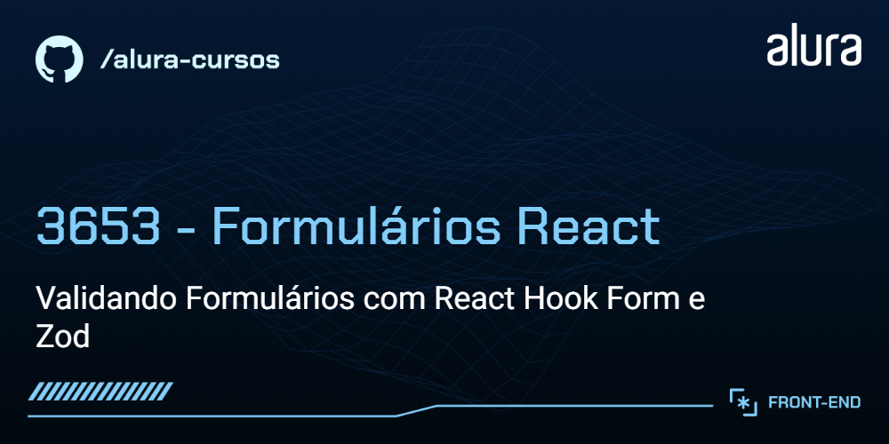

# Voll

A Voll med é um clínica especializada em conectar os profissionais certos aos clientes. Atualmente está na fase de desenvolvimento de seu site e app, que conta com uma grande quantidade de funcionalidades. Uma dessas funcionalidades são os seus formulários, que precisam possuir algum tipo de validação dos dados de seus clientes.


## 🔨 Funcionalidades do projeto

Neste estágio de desenvolvimento, a Voll possui as seguintes funcionalidades:

- Formulário de cadastro de Paciente
- Formulário de cadastro de médicos especialistas

O [Figma dessa aplicação você encontra aqui](https://www.figma.com/file/hsW25fAq36IDzzIxBtpgCd/Voll.med-%7C-React-Hook-Forms?type=design&node-id=57-1388&mode=design).

## ✔️ Técnicas e tecnologias utilizadas

O projeto utiliza as seguintes tecnologias e bibliotecas:

- `React` - Framework JavaScript
- `Vite` - Build tool para desenvolvimento rápido
- `TypeScript` - Linguagem de programação principal
- `React Hook Forms` - Biblioteca de validação de formulários React
- `Zod` - Biblioteca de criação de esquemas de validação
- `Styled Components` - Ferramenta de estilização do nosso projeto
- `Figma` - Para prototipagem do projeto

E muito mais...

## 🛠️ Abrir e rodar o projeto

Para executar o projeto Meteora em seu ambiente local, siga estas etapas:

1. Certifique-se de ter o Node.js instalado em sua máquina. Nós usamos a versão 20.10.0

2. Baixe o repositório do projeto.

3. Extraia os arquivos para uma pasta de sua preferência.

4. Navegue até a pasta em questão via terminal (cmd):

```bash
cd react-forms-zod
```

5. Instale as dependências usando o npm:

```bash
npm install
```

6. Inicie o projeto localmente:

```bash
npm run dev
```

## 📚 Mais informações do curso

Gostou do projeto e quer conhecer mais?

O design e protótipo deste projeto podem ser encontrados [aqui](https://www.figma.com/file/hsW25fAq36IDzzIxBtpgCd/Voll.med-%7C-React-Hook-Forms?type=design&node-id=57-1388&mode=design). Se você quiser desenvolver este projeto completo nas versões web e mobile, recomendo acessar a Formação [Desenvolva aplicações Web e Mobile com React e React Native](https://cursos.alura.com.br/formacao-aplicacoes-web-mobile-react-react-native)

Aproveite o desenvolvimento e aprimoramento da Voll!
